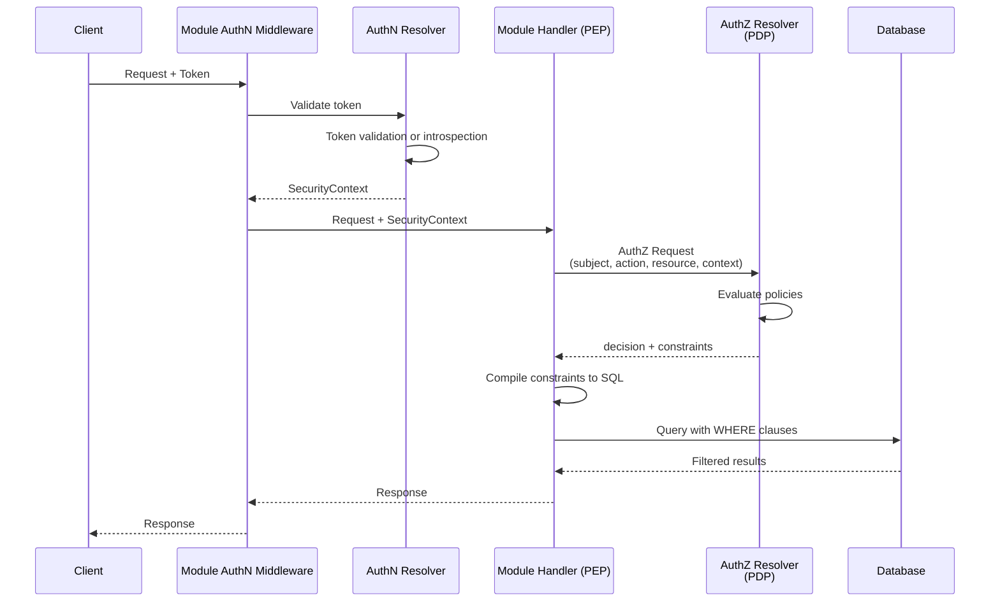
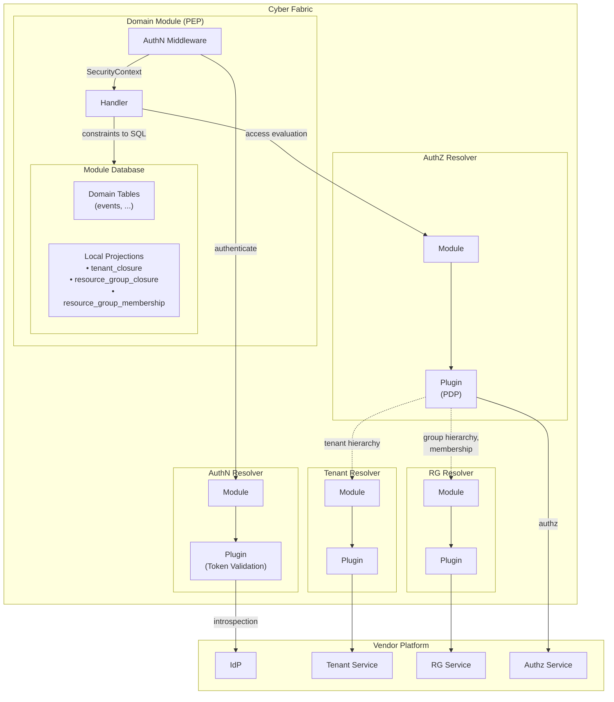
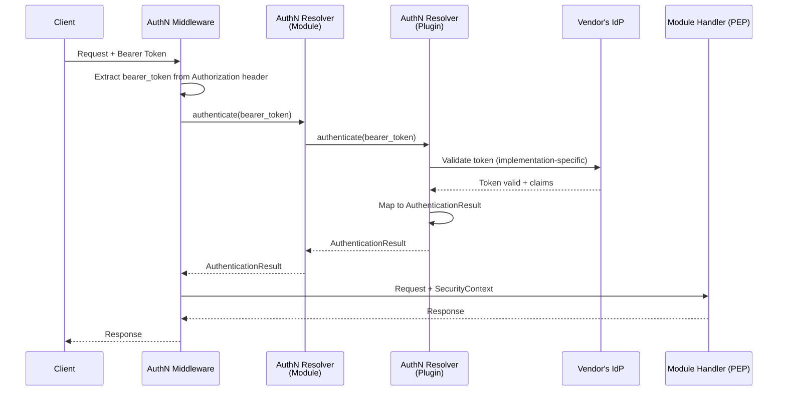
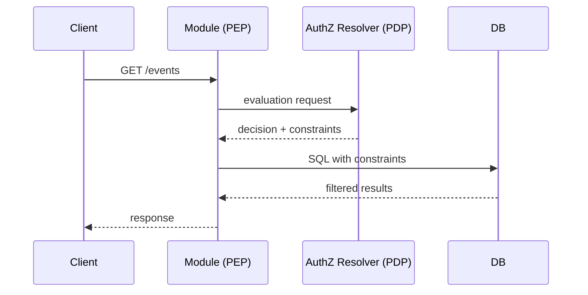

# Authentication & Authorization Design

## Table of Contents

- [Overview](#overview)
- [Token Scopes](#token-scopes)
- [Authentication](#authentication)
- [Authorization](#authorization)
  - [Why AuthZEN (and Why It's Not Enough)](#why-authzen-and-why-its-not-enough)
  - [PEP Enforcement](#pep-enforcement)
  - [Authorization Decision Caching](#authorization-decision-caching)
  - [API Specifications](#api-specifications)
  - [Predicate Types Reference](#predicate-types-reference)
  - [PEP Property Mapping](#pep-property-mapping)
  - [Capabilities -> Predicate Matrix](#capabilities---predicate-matrix)
  - [Table Schemas (Local Projections)](#table-schemas-local-projections)
  - [Usage Scenarios](#usage-scenarios)
- [Open Questions](#open-questions)
- [References](#references)

---

## Overview

This document describes Cyber Fabric's approach to authentication (AuthN) and authorization (AuthZ).

**Authentication** verifies the identity of the subject making a request. Cyber Fabric uses the **AuthN Resolver** module to integrate with vendor's Identity Provider (IdP), validate access tokens, and extract subject identity into a `SecurityContext`.

**Authorization** determines what the authenticated subject can do. Cyber Fabric uses the **AuthZ Resolver** module (acting as PDP) to obtain access decisions and query-level constraints. The core challenge: Cyber Fabric modules need to enforce authorization at the **query level** (SQL WHERE clauses), not just perform point-in-time access checks.

See [ADR 0001](./ADR/0001-pdp-pep-authorization-model.md) for the authorization model and [ADR 0002](./ADR/0002-split-authn-authz-resolvers.md) for the rationale behind separating AuthN and AuthZ.

### PDP/PEP Model

This document uses the PDP/PEP authorization model (per NIST SP 800-162):

- **PDP (Policy Decision Point)** — evaluates policies and returns access decisions with constraints
- **PEP (Policy Enforcement Point)** — enforces PDP decisions at resource access points

In Cyber Fabric's architecture:
- **AuthN Resolver** validates tokens and produces SecurityContext (separate concern from PDP)
- **AuthZ Resolver** (via vendor-specific plugin) serves as the **PDP**
- **Domain modules** act as **PEPs**, applying constraints to database queries

### Core Terms

- **Access Token** - Credential presented by the client to authenticate requests. Format is not restricted — can be opaque token (validated via introspection) or self-contained JWT. The key requirement: it must enable authentication and subject identification.
- **Subject / Principal** - Actor initiating the request (user or API client), identified via access token
- **Tenant** - Domain of ownership/responsibility and policy (billing, security, data isolation). See [TENANT_MODEL.md](./TENANT_MODEL.md)
- **Subject Owner Tenant** - Tenant the subject belongs to (owning tenant of the subject)
- **Context Tenant** - Tenant scope root for the operation (may differ from subject owner tenant in cross-tenant scenarios)
- **Resource Owner Tenant** - Actual tenant owning the resource (`owner_tenant_id`)
- **Resource** - Object with owner tenant identifier
- **Resource Group** - Optional container for resources, used for access control. See [RESOURCE_GROUP_MODEL.md](./RESOURCE_GROUP_MODEL.md)
- **Permission** - `{ resource_type, action }` - allowed operation identifier
- **Access Constraints** - Structured predicates returned by the PDP for query-time enforcement. NOT policies (stored vendor-side) or "grants" (OAuth flows, Zanzibar tuples), but compiled, time-bound enforcement artifacts computed at evaluation time.
- **Security Context** - Result of successful authentication containing subject identity, tenant information, and optionally the original bearer token. Flows from authentication to authorization. Required fields: `subject_id`, `subject_tenant_id`, `token_scopes`. Optional fields: `subject_type`, `bearer_token`.
- **Token Scopes** - Capability restrictions extracted from the access token. Act as a "ceiling" on what an application can do, regardless of user's actual permissions. See [Token Scopes](#token-scopes).

### Request Flow



**Separation of concerns:**
1. **AuthN Middleware** — calls AuthN Resolver to validate token, produces `SecurityContext`
2. **Module Handler (PEP)** — receives SecurityContext, builds AuthZ request, compiles constraints to SQL
3. **AuthZ Resolver (PDP)** — evaluates policies, returns decision + constraints

### AuthN Resolver and AuthZ Resolver: Module + Plugin Architecture

Since IdP and PDP are vendor-specific, Cyber Fabric cannot implement authentication and authorization directly. Instead, we use the **module + plugin** pattern with two separate resolvers:

- **AuthN Resolver** — a Cyber Fabric module with plugins that defines a unified interface for authentication operations (token validation, introspection, SecurityContext production)
- **AuthZ Resolver** — a Cyber Fabric module with plugins that defines a unified interface for authorization operations (PDP functionality, policy evaluation, constraint generation)
- **Vendor Plugins** — implement the AuthN and/or AuthZ interfaces, integrating with vendor's IdP and Authorization API

This separation provides:
- **Separation of concerns** — OIDC/JWT standards (AuthN) vs AuthZEN standards (AuthZ)
- **Deployment flexibility** — AuthN on edge, AuthZ centralized in distributed scenarios
- **Security boundaries** — Credentials (tokens) isolated in AuthN layer, AuthZ works with validated identity
- **Mix & match vendors** — Use different vendors for IdP (AuthN) and Policy Engine (AuthZ)

Each vendor develops their own AuthN and AuthZ plugins (or a unified plugin implementing both interfaces) that bridge to their specific systems. See [ADR 0002](./ADR/0002-split-authn-authz-resolvers.md) for the rationale behind this separation.

### Plugin Roles

**AuthN Plugin:**

The AuthN Resolver plugin bridges Cyber Fabric to the vendor's IdP. The plugin is responsible for:
- **IdP communication** — calling introspection endpoints, handling IdP-specific protocols
- **Claim enrichment** — if the IdP doesn't include `subject_type` or `subject_tenant_id` in tokens, the plugin fetches this information from vendor services
- **Response mapping** — converting IdP-specific responses to `SecurityContext`
- **Token scope extraction** — detecting first-party vs third-party apps and setting `token_scopes` accordingly

**AuthZ Plugin:**

The AuthZ Resolver plugin bridges Cyber Fabric to the vendor's Authorization Service (PDP). The plugin is responsible for:
- **Policy evaluation** — calling vendor's authorization API with subject, action, resource, context
- **Constraint generation** — translating vendor's policy decisions into SQL-compilable constraints
- **Hierarchy queries** — using Tenant Resolver and RG Resolver to query tenant and group hierarchies for constraint generation
- **Token validation** (optional) — in out-of-process deployments, independently validating bearer_token for defense-in-depth

**Policy Storage and Retrieval (Out of Scope):**

How authorization rules are stored, represented, and retrieved within the PDP is entirely a vendor implementation detail. Cyber Fabric defines only the PDP-PEP contract (request/response format via AuthZEN-extended API).

Vendors may use any policy model and storage mechanism:
- **RBAC** — role-permission tables, role hierarchies
- **ABAC** — attribute-based rules, policy DSLs
- **ReBAC** — relationship tuples (Zanzibar-style), graph databases
- **Custom models** — proprietary formats, hybrid approaches

The AuthZ Resolver plugin may obtain policy information through any method:
- Call the vendor's centralized Authorization Service (PDP) via API
- Query the vendor's Policy Service or ACL storage directly
- Extract embedded permissions from the bearer token itself (if the token contains authorization claims)
- Use a hybrid approach (e.g., token for basic permissions + service call for fine-grained checks)

The plugin is responsible for evaluating policies (in whatever internal format and from whatever source the vendor uses) and translating the results into the standardized `constraints` JSON format that PEPs can compile to SQL. All policy computation, permission resolution, and authorization logic happens within the plugin based on the vendor's chosen authorization approach.

**Unified Plugin Pattern:**

Vendors with integrated AuthN+AuthZ APIs can provide a unified plugin implementing both interfaces, allowing single API calls to vendor services, shared caching between AuthN and AuthZ operations, and coordinated version updates. See [ADR 0002](./ADR/0002-split-authn-authz-resolvers.md) for details.

### Integration Architecture



**Communication flow:**
1. **AuthN Middleware → AuthN Resolver (Module)** — Middleware calls `authenticate(bearer_token)` to validate token and get `AuthenticationResult`
2. **AuthN Resolver (Module) → AuthN Resolver (Plugin)** — Module delegates to vendor plugin
3. **AuthN Resolver (Plugin) → IdP** — Token validation (JWT signature verification or introspection)
4. **AuthN Middleware → Handler** — Middleware extracts `SecurityContext` from `AuthenticationResult` and passes to handler
5. **Handler → AuthZ Resolver (Module)** — PEP calls `/access/v1/evaluation` for authorization decisions with `SecurityContext`
6. **AuthZ Resolver (Module) → AuthZ Resolver (Plugin)** — Module delegates to vendor plugin (PDP)
7. **AuthZ Resolver (Plugin) → Authz Svc** — Policy evaluation
8. **AuthZ Resolver (Plugin) → Tenant Resolver (Module)** — Tenant hierarchy queries
9. **AuthZ Resolver (Plugin) → RG Resolver (Module)** — Group hierarchy and membership queries
10. **Tenant/RG Resolver (Module) → Plugin → Vendor Service** — Module delegates to plugin, plugin syncs from vendor

### Deployment Modes and Trust Model

Both AuthN Resolver and AuthZ Resolver can run in two deployment configurations:

**In-Process (Plugin):**
- Resolvers run as plugins in the same process
- Communication via direct function calls
- Trust model: implicit — same process, same memory space
- No additional authentication required

**Out-of-Process (Separate Service):**
- Resolvers run as separate processes (same machine or remote)
- Communication via gRPC
- Trust model: explicit authentication required
- **mTLS required** — Resolver authenticates that the caller is legitimate

**Trust Boundaries:**

In both modes, AuthZ Resolver (PDP) trusts subject identity data from PEP. The mTLS in out-of-process mode authenticates *which service* is calling, not the validity of subject claims. Subject identity originates from AuthN Resolver (Module) and flows through PEP to AuthZ Resolver.

| Aspect | In-Process | Out-of-Process |
|--------|------------|----------------|
| Module → Plugin | implicit | mTLS |
| Subject identity trust | Same process | Authenticated caller |
| Network exposure | none | internal network only |

## Token Scopes

### Overview

Token scopes provide capability narrowing for third-party applications. They act as a "ceiling" on what an application can do, regardless of user's actual permissions.

**Key principle:** `effective_access = min(token_scopes, user_permissions)`

### Scope vs Permission

| Aspect | Scope | Permission |
|--------|-------|------------|
| Granularity | Coarse (human-readable) | Fine (technical) |
| Example | `read:calendar` | `gts.x.core.events.event.v1~:read` |
| Who defines | OAuth consent / IdP | PDP policies |
| Purpose | Limit app capabilities | Grant user access |

### First-party vs Third-party Apps

| App Type | Example | token_scopes | Behavior |
|----------|---------|--------------|----------|
| First-party | UI, CLI | `["*"]` | No restrictions, full user permissions |
| Third-party | Partner integrations | `["read:events"]` | Limited to granted scopes |

**Detection:** AuthN Resolver plugin determines app type during introspection and sets `token_scopes` accordingly. Cyber Fabric does not maintain a trusted client list.

### Vendor Neutrality

Cyber Fabric accepts scopes as opaque strings (`Vec<String>`). Different vendors use
different formats:
- Google-style: `https://api.vendor.com/auth/tasks.read`
- Simple strings: `read_all`, `admin`
- No scopes: Some vendors encode everything in roles

AuthN Resolver plugin is responsible for:
1. Extracting scopes from token (JWT claim or introspection response)
2. Mapping vendor format to internal representation
3. Setting `["*"]` for first-party apps

### SecurityContext Integration

```rust
SecurityContext {
    subject_id: "user-123",
    subject_type: Some("gts.x.core.security.subject_user.v1~"),  // optional
    subject_tenant_id: "tenant-456",                             // required
    bearer_token: Some(Secret::new("eyJ...".into())),            // optional, Secret<String>
    token_scopes: ["*"],  // first-party: full access
    // OR
    token_scopes: ["read:events", "write:tasks"],  // third-party: limited
}
```

### PDP Evaluation Flow

1. **PEP** includes `token_scopes` in evaluation request context
2. **PDP** applies scope restrictions:
   - If `token_scopes: ["*"]` → no scope-based restrictions
   - Otherwise → intersect with user permissions
3. **PDP** returns constraints reflecting both scopes and permissions

### Gateway Scope Enforcement (Optional)

For performance-critical paths, API Gateway can reject requests early based on
scope mismatch without calling PDP.

**Configuration:**
```yaml
auth:
  gateway_scope_checks:
    enabled: true
    routes:
      "/admin/*":
        required_scopes: ["admin"]
      "/events/v1/*":
        required_scopes: ["read:events", "write:events"]  # any of these
```

**Behavior:**
- If `token_scopes: ["*"]` → always pass
- If `token_scopes` contains any of `required_scopes` → pass
- Otherwise → 403 Forbidden (before PDP call)

**Note:** This is coarse-grained optimization. Fine-grained permission checks still happen in PDP.

---

## Authentication

### Overview

Authentication is performed by **AuthN middleware** within the module that accepts the request. The middleware:
1. Extracts the bearer token from the request
2. Calls **AuthN Resolver** to do authentication
3. Receives `AuthenticationResult` containing validated subject identity
4. Passes the `SecurityContext` from `AuthenticationResult` to the module's handler (PEP)

Authentication is handled by the **AuthN Resolver** — a module with plugins and a minimalist interface that validates bearer tokens and produces `AuthenticationResult`.

**Module Structure:**

- **authn-resolver-sdk** — SDK package containing:
  - `AuthNResolverClient` trait (public API for other modules)
  - `AuthNResolverPluginClient` trait (API for plugins)
  - `AuthenticationResult`, `SecurityContext` models
  - `AuthNResolverError` error types

- **authn-resolver** — Main module that:
  - Implements `AuthNResolverClient` trait
  - Discovers and delegates to vendor-specific plugins via GTS types-registry
  - Registers client in `ClientHub` for consumption by other modules

**Public Client Interface:**

```rust
#[async_trait]
pub trait AuthNResolverClient: Send + Sync {
    /// Authenticate a bearer token and return the authentication result.
    ///
    /// # Errors
    ///
    /// - `Unauthorized` if the token is malformed/invalid/expired or authentication fails
    /// - `ServiceUnavailable` if the IdP is unreachable
    /// - `NoPluginAvailable` if no plugin is configured
    ///
    /// # Arguments
    ///
    /// * `bearer_token` - The bearer token from the Authorization header
    async fn authenticate(&self, bearer_token: &str) -> Result<AuthenticationResult, AuthNResolverError>;
}
```

**Plugin Client Interface:**

```rust
#[async_trait]
pub trait AuthNResolverPluginClient: Send + Sync {
    /// Authenticate a bearer token using vendor-specific validation logic.
    ///
    /// Plugins implement this method with their validation strategy
    /// (JWT local validation, token introspection, custom protocols, etc.).
    ///
    /// # Arguments
    ///
    /// * `bearer_token` - The bearer token to validate
    async fn authenticate(&self, bearer_token: &str) -> Result<AuthenticationResult, AuthNResolverError>;
}
```

**Architecture:**
- **AuthN Middleware** — Extracts bearer token from request headers
- **AuthN Resolver (Module)** — Delegates to vendor-specific plugin
- **AuthN Resolver Plugin** — Implements token validation logic (JWT, introspection, custom protocols, etc.)
- **Output** — `AuthenticationResult` containing `SecurityContext`

**Request Flow:**



### AuthenticationResult

The `AuthenticationResult` is returned by the AuthN Resolver upon successful authentication:

```rust
pub struct AuthenticationResult {
    /// The validated security context.
    pub security_context: SecurityContext,
}
```

### SecurityContext

The `SecurityContext` is extracted from `AuthenticationResult` and flows from AuthN Resolver to PEPs (via handlers):

```rust
use secrecy::Secret;

SecurityContext {
    subject_id: String,                    // required - from `sub` claim or IdP response
    subject_type: Option<GtsTypeId>,       // optional - vendor-specific subject type
    subject_tenant_id: TenantId,           // required - Subject Owner Tenant
    token_scopes: Vec<String>,             // required - capability restrictions (["*"] for first-party)
    bearer_token: Option<Secret<String>>,  // optional - original token for forwarding to PDP
}
```

**Field Semantics:**

| Field | Required | Description | Used By |
|-------|----------|-------------|---------|
| `subject_id` | Yes | Unique identifier for the subject | All authorization decisions |
| `subject_type` | No | GTS type identifier (e.g., `gts.x.core.security.subject_user.v1~`) | PDP for role/permission mapping |
| `subject_tenant_id` | Yes | Subject Owner Tenant — tenant the subject belongs to. Used as default `owner_tenant_id` for CREATE when the API has no explicit tenant field (see S06 in [AUTHZ_USAGE_SCENARIOS.md](./AUTHZ_USAGE_SCENARIOS.md)) | PDP for tenant context, PEP for resource ownership |
| `token_scopes` | Yes | Capability restrictions from token (see [Token Scopes](#token-scopes)) | PDP for scope narrowing |
| `bearer_token` | No | Original bearer token (wrapped in `Secret` from [secrecy](https://crates.io/crates/secrecy) crate) | PDP validation, external API calls |

**Security Notes:**
- Token expiration (`exp`) is validated during authentication but not included in SecurityContext (expiration is token metadata, not identity)
- `bearer_token` uses `Secret<String>` from the `secrecy` crate which provides: redacted `Debug` output, no `Display` impl, and zeroization on drop
- `bearer_token` MUST NOT be logged, serialized to persistent storage, or included in error messages
- The token is included for:
  1. **PDP validation** — In out-of-process deployments, AuthZ Resolver may independently validate the token for defense-in-depth
  2. **Forwarding** — AuthZ Resolver plugin may need to call external vendor services requiring authentication

### Plugin Responsibilities

The AuthN Resolver plugin bridges Cyber Fabric to the vendor's IdP. Plugin responsibilities:

1. **Token Validation** — Implement vendor-specific validation logic (JWT signature verification, introspection, custom protocols)
2. **Claim Extraction** — Extract subject identity from token claims or introspection response
3. **Claim Enrichment** — If IdP doesn't include required claims (`subject_type`, `subject_tenant_id`), fetch from vendor services
4. **Token Scope Detection** — Determine first-party vs third-party apps and set `token_scopes` accordingly (see [Token Scopes](#token-scopes))
5. **Response Mapping** — Convert vendor-specific responses to `AuthenticationResult` (containing `SecurityContext`)

### Rationale: Minimalist Interface

For the rationale behind this single-method interface design, see [ADR 0003: AuthN Resolver Minimalist Interface](./ADR/0003-authn-resolver-minimalist-interface.md).

### Implementation Reference

For a complete implementation of JWT + OIDC authentication (JWT local validation, token introspection, OpenID Connect Discovery), see **[AUTHN_JWT_OIDC_PLUGIN.md](./AUTHN_JWT_OIDC_PLUGIN.md)**.

This reference implementation covers:
- JWT and opaque token support
- Multiple validation modes (`never`, `opaque_only`, `always`)
- OpenID Connect Discovery integration
- JWKS and introspection caching
- Configuration examples for standard OIDC providers

---

## Authorization

### Why AuthZEN (and Why It's Not Enough)

We chose [OpenID AuthZEN Authorization API 1.0](https://openid.net/specs/authorization-api-1_0.html) (approved 2026-01-12) as the foundation for AuthZ Resolver. See [ADR 0001](./ADR/0001-pdp-pep-authorization-model.md) for the full analysis of considered options.

**Why AuthZEN:**
- Industry standard with growing ecosystem
- Vendor-neutral: doesn't dictate policy model (RBAC/ABAC/ReBAC)
- Clean subject/action/resource/context structure
- Extensible via `context` field

However, AuthZEN out of the box doesn't solve Cyber Fabric's core requirement: **query-level authorization**.

#### Why Access Evaluation API Alone Isn't Enough

AuthZEN's Access Evaluation API answers: "Can subject S perform action A on resource R?" — a point-in-time check returning `decision: true/false`.

##### LIST Operations

For **LIST operations** with Access Evaluation API, we'd need an iterative process:

1. Fetch a batch of resources from DB (e.g., `LIMIT 100` to get candidates for a page of 10)
2. Send batch to PDP for evaluation (AuthZEN supports batching via Access Evaluations API)
3. Filter results based on decisions
4. If filtered result < requested page size → fetch next batch, repeat

**The core problem**: unpredictable number of iterations. If the user has access to only 1% of resources, fetching a page of 10 items might require 10+ round-trips (DB → PDP → filter → not enough → repeat). Worst case: user has access to nothing, and we scan the entire table before returning empty result.

**Additional problems:**
- **Pagination cursor invalidation** — cursor points to DB offset, but after filtering the mapping breaks
- **Total count impossible** — can't know total accessible count without evaluating all resources
- **Inconsistent page sizes** — hard to guarantee exactly N items per page

##### Point Operations (GET/UPDATE/DELETE)

For **point operations**, Access Evaluation API could technically work, but requires an inefficient flow:

1. Query database to fetch the resource
2. Send resource to PDP for evaluation
3. If denied, return 403/404

**The problem**: the subject might not have rights to access this resource type at all. The database query is wasteful — we should fail fast before touching the database.

**What we want instead:**
1. Ask PDP first: "Can subject S perform action A on resource type T?"
2. If denied → 403 immediately (fail-fast, no database query)
3. If allowed → get constraints, execute query with `WHERE id = :id AND (constraints)`
4. If 0 rows → 404 (hides resource existence from unauthorized users)

#### Why Search API Doesn't Work

AuthZEN's Resource Search API answers: "What resources can subject S perform action A on?" — returning a list of resource IDs.

This **assumes the PDP has access to resource data**. In Cyber Fabric's architecture, resources live in the PEP's database — the PDP cannot enumerate what it doesn't have.

This creates an architectural mismatch:
- **PDP** knows "who can access what" (authorization policies)
- **PEP** knows "what exists" (resources in database)

To use Search API, we'd need to sync all resources to the PDP — defeating the purpose of keeping data local.

#### Our Solution: Extended Evaluation Response

We extend AuthZEN's evaluation response with optional `context.constraints`. Instead of returning resource IDs (enumeration), the PDP returns **predicates** that the PEP compiles to SQL WHERE clauses:

```jsonc
// PDP response
{
  "decision": true,
  "context": {
    "constraints": [
      {
        "predicates": [
          { "type": "in_tenant_subtree", "resource_property": "owner_tenant_id", "root_tenant_id": "tenant-123", "barrier_mode": "all" }
        ]
      }
    ]
  }
}
// PEP compiles to: WHERE owner_tenant_id IN (SELECT descendant_id FROM tenant_closure WHERE ancestor_id = 'tenant-123' AND barrier = 0)
// Result: SELECT * FROM events WHERE (constraints) LIMIT 10 — correct pagination!
```

This gives us:
- **O(1) authorization overhead** per query (single PDP call)
- **Correct pagination** — constraints applied at SQL level before LIMIT
- **Accurate counts** — database handles filtering
- **No resource sync** — PDP never needs to know about individual resources

---

### PEP Enforcement

#### Unified PEP Flow

All operations (LIST, GET, UPDATE, DELETE) follow the same flow:



The only difference between LIST and point operations (GET/UPDATE/DELETE) is whether `resource.id` is present.

#### Constraint Compilation to SQL

When constraints are present, the PEP compiles each constraint to SQL WHERE clauses:

1. **Predicates within a constraint** (`predicates` array) are AND'd together
2. **Multiple constraints** (`constraints` array) are OR'd together
3. **Unknown predicate types** cause that constraint to be treated as false (fail-closed)

#### Fail-Closed Rules

The PEP MUST:

1. **Validate decision** - `decision: false` or missing -> deny all (403 Forbidden)
2. **Enforce require_constraints** - If `require_constraints: true` and `decision: true` but no `constraints` -> deny all (403 Forbidden)
3. **Apply constraints when present** - If `constraints` array is present, apply to SQL; if all constraints evaluate to false -> deny all
4. **Trust decision when constraints not required** - `decision: true` without `constraints` AND `require_constraints: false` -> allow (non-resource decisions only; all standard CRUD operations use `require_constraints: true`)
5. **Handle unreachable PDP** - Network failure, timeout -> deny all
6. **Handle unknown predicate types** - Treat containing constraint as false; if all constraints false -> deny all
7. **Handle empty or missing predicates** - If a constraint has empty `predicates: []` or missing `predicates` field -> treat constraint as malformed -> deny all. Constraints MUST have at least one predicate.
8. **Handle missing required fields** - Treat containing constraint as false
9. **Handle unknown property names** - Treat containing constraint as false (PEP doesn't know how to map). This is a **PDP contract violation** — PDP MUST only return properties from the `supported_properties` list provided in the request. PEP MUST log this as an error for debugging, then fail-closed. If all constraints evaluate to false, deny access (403 Forbidden).
10. **Handle empty constraints array** - If `constraints` field is present but empty (`constraints: []`) -> deny all. An empty array means no access paths exist (OR of empty set is false).

---

#### Constraints Scope and Limitations

Constraints are designed for **data-scoping policies** — policies that can be expressed as SQL WHERE predicates. This includes:

- **Tenant isolation** — `owner_tenant_id = :tenant` or subtree membership
- **Resource group membership** — resource belongs to specific groups
- **Ownership** — `created_by = :subject_id`
- **Attribute-based filtering** — equality/IN checks on resource properties

Some policies cannot be expressed as SQL constraints (e.g., time-based access, IP restrictions, rate limiting, external data dependencies). For these, PDP returns `decision: false` or enforcement happens at a different layer (API Gateway, middleware).

**Design rationale:** Constraints solve the specific problem of efficient, paginated queries with authorization. Other policy types are orthogonal and handled at appropriate layers in the stack.

---

### Authorization Decision Caching

PEP implementations MAY cache authorization decisions returned by the PDP to reduce latency and PDP load.

**Status: Requires further design work.** This section outlines high-level considerations. Detailed caching protocol (cache-control metadata, TTL negotiation, invalidation signals) is not yet specified.

#### Critical Security Requirements

Any caching implementation MUST satisfy:

1. **Token expiration boundary** - Cached decisions MUST NOT outlive the token's validity period (`exp` claim). Cache TTL must be: `min(pdp_suggested_ttl, token_expires_at - now)`.

2. **Scope isolation** - Token scopes MUST be part of the cache key. A decision cached for a first-party token (broad scope `["*"]`) MUST NOT be reused for a third-party app token (narrow scopes like `["users:read"]`). This prevents privilege escalation via cache.

3. **Tenant isolation** - Cache key MUST include tenant context to prevent cross-tenant data leakage.

#### Open Questions (TODO)

- Cache key structure - Which request fields participate? How to canonicalize `resource.properties`?
- Cache-control protocol - Should PDP signal cacheability? TTL negotiation?
- Invalidation strategy - Proactive invalidation (policy version, WebSocket events) vs pure TTL expiration?
- Token expiration access - Add `token_expires_at` to `SecurityContext` or pass separately?
- Stale-while-revalidate - For zero-downtime policy updates?

---

### API Specifications

> **Note on interface representation:** The Authentication section above uses Rust trait definitions to specify the AuthN Resolver interface, while this Authorization section uses JSON examples (REST API payloads). This is intentional — authorization request/response payloads are more verbose and complex, making JSON more readable for documentation purposes. The Rust trait interface for AuthZ Resolver will be specified in the AuthZ Resolver module design documentation.

#### Access Evaluation API (AuthZEN-extended)

Two endpoints for authorization checks, following AuthZEN structure:

- `POST /access/v1/evaluation` - Single evaluation request
- `POST /access/v1/evaluations` - Batch evaluation (array of requests -> array of responses)

PDP returns `decision` plus optional `constraints` for each evaluation.

#### Design Principles

1. **AuthZEN alignment** - Use same `subject`, `action`, `resource`, `context` structure
2. **Constraints are optional** - PDP decides when to include based on action type
3. **Constraint-first** - Return predicates, not enumerated IDs
4. **Capability negotiation** - PEP declares enforcement capabilities
5. **Fail-closed** - Unknown constraints or schemas result in deny
6. **OR/AND semantics** - Multiple constraints are OR'd (alternative access paths), predicates within constraint are AND'd
7. **Token passthrough** - Original bearer token optionally included in `context.bearer_token` for PDP validation and external service calls (MUST NOT be logged)
8. **Property schema contract** - PEP declares supported properties; PDP validates constraints use only supported properties

#### Request / Response Example

**Scenario:** Event Broker module handles `GET /events?topic=some_topic` request. The handler:
1. Receives `SecurityContext` from AuthN middleware
2. Builds AuthZ request from SecurityContext + HTTP request params + handler config
3. Sends to AuthZ Resolver (PDP)
4. Receives decision + constraints
5. Compiles constraints to SQL WHERE clause

#### Request

```
POST /access/v1/evaluation
Content-Type: application/json
```

```jsonc
{
  // Subject — from SecurityContext (produced by AuthN Resolver)
  "subject": {
    "type": "gts.x.core.security.user.v1~",          // optional - SecurityContext.subject_type
    "id": "a254d252-7129-4240-bae5-847c59008fb6",    // required - SecurityContext.subject_id
    "properties": {
      "tenant_id": "51f18034-3b2f-4bfa-bb99-22113bddee68"  // optional - SecurityContext.subject_tenant_id
    }
  },

  // Action — handler sets based on HTTP method / operation
  "action": {
    "name": "list"  // "list", "read", "update", "delete", "create"
  },

  // Resource — handler sets type; id/properties from HTTP request
  "resource": {
    "type": "gts.x.core.events.event.v1~",               // handler: module's resource GTS type
    "id": "e81307e5-5ee8-4c0a-8d1f-bd98a65c517e",   // URL path param (point ops only, absent for list)
    "properties": {
      "topic_id": "gts.x.core.events.topic.v1~z.app._.some_topic.v1"  // from query param ?topic=...
    }
  },

  // Context — mix of SecurityContext, request params, and handler config
  "context": {
    // Context Tenant (optional) — PDP, for example, can determine from token_scopes or subject.tenant_id if absent
    "tenant_context": {
      "mode": "subtree",           // "root_only" | "subtree", default: "subtree"
      "root_id": "51f18034-3b2f-4bfa-bb99-22113bddee68",  // optional - request param (URL query, header), handler can set
      "barrier_mode": "all",       // default: "all"
      "tenant_status": ["active", "suspended"]  // optional filter
    },

    "token_scopes": ["read:events", "write:tasks"],  // SecurityContext.token_scopes
    "require_constraints": true,   // handler config: LIST requires constraints
    "capabilities": ["tenant_hierarchy"],  // module config: has tenant_closure table
    "supported_properties": ["owner_tenant_id", "topic_id", "id"],  // handler config: properties PEP can map to SQL
    "bearer_token": "eyJhbGciOiJSUzI1NiIs..."  // SecurityContext.bearer_token: Secret<String> (optional, see notes below)
  }
}
```

#### Response

The response contains a `decision` and, when `decision: true`, optional `context.constraints`. Each constraint is an object with a `predicates` array that the PEP compiles to SQL.

**Allow Response:**

```jsonc
{
  "decision": true,
  "context": {
    // Multiple constraints are OR'd together (alternative access paths)
    // Each constraint's predicates are AND'd together
    "constraints": [
      {
        "predicates": [
          {
            // Tenant subtree predicate - uses local tenant_closure table
            "type": "in_tenant_subtree",
            "resource_property": "owner_tenant_id",
            "root_tenant_id": "51f18034-3b2f-4bfa-bb99-22113bddee68",
            "barrier_mode": "all",       // default: "all"
            "tenant_status": ["active", "suspended"]
          },
          {
            // Equality predicate
            "type": "eq",
            "resource_property": "topic_id",
            "value": "gts.x.core.events.topic.v1~z.app._.some_topic.v1"
          }
        ]
      }
    ]
  }
}
```

**Deny Response:**

```jsonc
{
  "decision": false,
  "context": {
    // deny_reason is required when decision is false
    "deny_reason": {
      // GTS-formatted error code for programmatic handling (required)
      "error_code": "gts.x.core.errors.err.v1~x.authz.errors.insufficient_permissions.v1",
      // Human-readable details for logging (optional)
      "details": "Subject lacks permission for action 'list' on resource type 'gts.x.core.events.event.v1~'"
    }
  }
}
```

**Note on `bearer_token`:** The `context.bearer_token` field is optional. Include it when PDP needs to: (1) validate token independently (defense-in-depth in OoP deployments), (2) call external vendor APIs requiring authentication, or (3) extract token-embedded policies/scopes. Omit it if PDP fully trusts PEP's claim extraction. Security: `bearer_token` is a credential — PDP MUST NOT log it or persist it. In Rust code, use `Secret<String>` from the `secrecy` crate (serializes to plain string in JSON).

**Note on `tenant_context`:** The `context.tenant_context` object is optional. It defines the tenant context for the operation:

| Field | Required | Default | Description |
|-------|----------|---------|-------------|
| `mode` | No | `"subtree"` | `"root_only"` (single tenant) or `"subtree"` (tenant + descendants) |
| `root_id` | No | — | Root context tenant ID. If absent, PDP determines from `token_scopes`, `subject.properties.tenant_id`, or something else - it's fully up to the PDP implementation |
| `barrier_mode` | No | `"all"` | `"all"` (respect barriers) or `"none"` (ignore barriers) |
| `tenant_status` | No | — | Filter by tenant status (e.g., `["active", "suspended"]`) |

The `barrier_mode` and `tenant_status` parameters apply to any scope source — whether explicitly provided via `root_id` or derived from the token/subject.

#### PEP Decision Matrix

| `decision` | `constraints` | `require_constraints` | PEP Action |
|------------|---------------|----------------------|------------|
| `false` | (any) | (any) | **403 Forbidden** |
| `true` | absent | `false` | Allow (trust PDP decision) |
| `true` | absent | `true` | **403 Forbidden** (constraints required but missing) |
| `true` | present | (any) | Apply constraints to SQL |

**Key insight:** PEP declares via `require_constraints` capability whether it needs constraints for the operation. For LIST operations, this should typically be `true`; for CREATE, it can be `false`.

#### Operation-Specific Behavior

**CREATE** (PDP returns constraints, same as other operations):
```jsonc
// PEP -> PDP
{
  "action": { "name": "create" },
  "resource": {
    "type": "gts.x.core.events.event.v1~",
    "properties": { "owner_tenant_id": "tenant-B", "topic_id": "..." }
  },
  "context": { "require_constraints": true }
  // ... subject, tenant_context
}

// PDP -> PEP
{
  "decision": true,
  "context": {
    "constraints": [
      { "predicates": [{ "type": "eq", "resource_property": "owner_tenant_id", "value": "tenant-B" }] }
    ]
  }
}

// PEP: compiles constraints, validates INSERT against them
// INSERT INTO events ...
```

**LIST** (constraints required):
```jsonc
// PEP -> PDP
{
  "action": { "name": "list" },
  "resource": { "type": "gts.x.core.events.event.v1~" }  // no id
  // ... subject, context
}

// PDP -> PEP
{
  "decision": true,
  "context": {
    "constraints": [
      {
        "predicates": [
          { "type": "in_tenant_subtree", "resource_property": "owner_tenant_id", "root_tenant_id": "tenant-A", "barrier_mode": "all" }
        ]
      }
    ]
  }
}

// PEP: SELECT * FROM events WHERE (constraints)
```

**GET/UPDATE/DELETE** (constraints for SQL-level enforcement):
```jsonc
// PEP -> PDP
{
  "action": { "name": "read" },
  "resource": { "type": "gts.x.core.events.event.v1~", "id": "evt-123" }
  // ... subject, context
}

// PDP -> PEP
{
  "decision": true,
  "context": {
    "constraints": [
      {
        "predicates": [
          { "type": "in_tenant_subtree", "resource_property": "owner_tenant_id", "root_tenant_id": "tenant-A", "barrier_mode": "all" }
        ]
      }
    ]
  }
}

// PEP: SELECT * FROM events WHERE id = :id AND (constraints)
// 0 rows -> 404 (hides resource existence)
```

#### Response with Resource Group Predicate

```jsonc
{
  "decision": true,
  "context": {
    "constraints": [
      {
        "predicates": [
          {
            // Tenant subtree predicate
            "type": "in_tenant_subtree",
            "resource_property": "owner_tenant_id",
            "root_tenant_id": "tenant-A",
            "barrier_mode": "all"  // default: "all"
          },
          {
            // Group subtree predicate - uses resource_group_membership + resource_group_closure tables
            "type": "in_group_subtree",
            "resource_property": "id",
            "root_group_id": "project-root-group"
          }
        ]
      }
    ]
  }
}
```

#### Deny Response

When the PDP denies access, it returns `decision: false` with a required `deny_reason` in the context (see example in [Response](#response) section above).

##### Deny Reason Structure

The `deny_reason` object is **required** when `decision: false` and provides structured information about why access was denied:

| Field | Required | Description |
|-------|----------|-------------|
| `error_code` | Yes | GTS-formatted error code from Type Registry. Used for programmatic handling (e.g., retry logic, user messaging, metrics) |
| `details` | No | Human-readable description for logging/debugging |

##### Standard Error Codes

| Code | When to use |
|------|-------------|
| `gts.x.core.errors.err.v1~x.authz.errors.insufficient_permissions.v1` | No matching policy, scope restricted, tenant boundary violation, missing role/permission |
| `gts.x.core.errors.err.v1~x.authz.errors.invalid_request.v1` | Malformed request (missing required fields, invalid format, unknown resource type) |

##### Vendor Extensibility

Vendors can define custom error codes via GTS namespace for domain-specific denial reasons:

```
gts.x.core.errors.err.v1~vendor.acme.license_expired.v1
gts.x.core.errors.err.v1~vendor.acme.quota_exceeded.v1
```

##### PEP Handling of Deny Reason

The PEP MUST:
1. **Use `error_code` for programmatic handling** — Route to appropriate logic based on error type (e.g., distinguish `invalid_request` from `insufficient_permissions` for different error responses or retry strategies)
2. **Log the deny_reason** — Include `error_code` and `details` in audit/debug logs for troubleshooting
3. **NOT expose details to client** — Return generic 403 Forbidden without leaking `details` or internal denial reasons

**Security rationale:** The `details` field may contain information about authorization policies, tenant structure, or resource existence. The PEP uses `error_code` for handling logic and logs `details` internally, but returns only a generic 403 to the client.

---

### Predicate Types Reference

All predicates filter resources based on their properties. The `resource_property` field specifies which property to filter on — these correspond directly to `resource.properties` in the request.

**Extensibility:**

The Rust SQL compilation library supports **extensible predicate types**:

- **Standard predicates** — Cyber Fabric's built-in modules use only the standard predicates listed below (`eq`, `in`, `in_tenant_subtree`, `in_group`, `in_group_subtree`)
- **Custom predicates** — Vendors can extend the system by:
  1. Registering new predicate types with the SQL compilation library
  2. Providing SQL compilation handlers for these predicates
  3. Returning custom predicates from their AuthZ Resolver Plugin (PDP)
  4. Using custom predicates in their domain modules

**Example use case:** A vendor with a custom geospatial authorization model could register a `within_geo_boundary` predicate type and implement its SQL compilation handler using PostGIS functions. Their PDP would return constraints like `{ "type": "within_geo_boundary", "resource_property": "location", "boundary": "...geojson..." }`, and the SQL compiler would generate the corresponding PostGIS query.

**Standard Predicate Types:**

| Type | Description | Required Fields | Optional Fields |
|------|-------------|-----------------|-----------------|
| `eq` | Property equals value | `resource_property`, `value` | — |
| `in` | Property in value list | `resource_property`, `values` | — |
| `in_tenant_subtree` | Tenant subtree via closure table | `resource_property`, `root_tenant_id` | `barrier_mode`, `tenant_status` |
| `in_group` | Flat group membership | `resource_property`, `group_ids` | — |
| `in_group_subtree` | Group subtree via closure table | `resource_property`, `root_group_id` | — |

#### 1. Equality Predicate (`type: "eq"`)

Compares resource property to a single value.

**Schema:**
- `type` (required): `"eq"`
- `resource_property` (required): Property name (e.g., `topic_id`, `owner_tenant_id`)
- `value` (required): Single value to compare

```jsonc
{ "type": "eq", "resource_property": "topic_id", "value": "uuid-123" }
// SQL: topic_id = 'uuid-123'
```

#### 2. IN Predicate (`type: "in"`)

Compares resource property to a list of values.

**Schema:**
- `type` (required): `"in"`
- `resource_property` (required): Property name (e.g., `owner_tenant_id`, `status`)
- `values` (required): Array of values

```jsonc
{ "type": "in", "resource_property": "owner_tenant_id", "values": ["tenant-1", "tenant-2"] }
// SQL: owner_tenant_id IN ('tenant-1', 'tenant-2')

{ "type": "in", "resource_property": "status", "values": ["active", "pending"] }
// SQL: status IN ('active', 'pending')
```

#### 3. Tenant Subtree Predicate (`type: "in_tenant_subtree"`)

Filters resources by tenant subtree using the closure table. The `resource_property` specifies which property contains the tenant ID.

**Schema:**
- `type` (required): `"in_tenant_subtree"`
- `resource_property` (required): Property containing tenant ID (e.g., `owner_tenant_id`)
- `root_tenant_id` (required): Root of tenant subtree
- `barrier_mode` (optional): Barrier handling mode, default `"all"`. Values: `"all"` (respect all barriers), `"none"` (ignore barriers)
- `tenant_status` (optional): Filter by tenant status

```jsonc
{
  "type": "in_tenant_subtree",
  "resource_property": "owner_tenant_id",
  "root_tenant_id": "tenant-A",
  "barrier_mode": "all",  // default: "all"
  "tenant_status": ["active", "suspended"]
}
// SQL: owner_tenant_id IN (
//   SELECT descendant_id FROM tenant_closure
//   WHERE ancestor_id = 'tenant-A'
//     AND barrier = 0  -- barrier_mode: "all"
//     AND descendant_status IN ('active', 'suspended')
// )
// Note: barrier_mode: "none" omits the barrier clause
```

**Barrier Modes:**

| Mode | SQL Clause | Description |
|------|------------|-------------|
| `"all"` | `AND barrier = 0` | (default) Respect all barriers. Stops traversal at `self_managed` tenants. |
| `"none"` | (omit clause) | Ignore barriers. Use for billing, tenant metadata, or other cross-barrier operations. |

**Future extensibility:** The `barrier` column is INT to allow future use as a bitmask for multiple barrier types. Future modes (e.g., `"data_sovereignty_only"`) can be added with selective checks like `(barrier & mask) = 0` without breaking existing consumers.

**Relationship to request `tenant_context`:** The PDP uses `context.tenant_context` from the request to determine the tenant context, then generates `in_tenant_subtree` predicates in the response. The predicate's `root_tenant_id` comes from either the request's `tenant_context.root_id` or PDP's resolution from token/subject. The `barrier_mode` and `tenant_status` parameters flow through from request to predicate.

#### 4. Group Membership Predicate (`type: "in_group"`)

Filters resources by explicit group membership. The `resource_property` specifies which property is used for group membership join.

**Schema:**
- `type` (required): `"in_group"`
- `resource_property` (required): Property for group membership join (typically `id`)
- `group_ids` (required): Array of group IDs

```jsonc
{ "type": "in_group", "resource_property": "id", "group_ids": ["group-1", "group-2"] }
// SQL: id IN (
//   SELECT resource_id FROM resource_group_membership
//   WHERE group_id IN ('group-1', 'group-2')
// )
```

#### 5. Group Subtree Predicate (`type: "in_group_subtree"`)

Filters resources by group subtree using the closure table. The `resource_property` specifies which property is used for group membership join.

**Schema:**
- `type` (required): `"in_group_subtree"`
- `resource_property` (required): Property for group membership join (typically `id`)
- `root_group_id` (required): Root of group subtree

```jsonc
{ "type": "in_group_subtree", "resource_property": "id", "root_group_id": "root-group" }
// SQL: id IN (
//   SELECT resource_id FROM resource_group_membership
//   WHERE group_id IN (
//     SELECT descendant_id FROM resource_group_closure
//     WHERE ancestor_id = 'root-group'
//   )
// )
```

#### Group Tenant Scoping

Resource groups are tenant-scoped. **PDP guarantees** that any `group_ids` (in `in_group` predicate) or `root_group_id` (in `in_group_subtree` predicate) returned in constraints belong to the same tenant as the request context.

**Trust model:**
- PEP trusts this guarantee and does not perform additional tenant validation on group IDs
- PEP does not have access to group metadata (including `tenant_id`) — only `resource_group_membership` and `resource_group_closure` tables
- AuthZ Resolver (PDP via plugin) has access to group hierarchy from vendor's Resource Group service and validates tenant ownership

**Defense in depth:** All group-based constraints also include a tenant predicate on the **resource** (typically `eq` on `owner_tenant_id`). This ensures:
1. PDP validates group belongs to correct tenant (group-level check)
2. SQL filters resources by tenant (resource-level check)

See [RESOURCE_GROUP_MODEL.md](./RESOURCE_GROUP_MODEL.md) for group data model details.

---

### PEP Property Mapping

The PEP declares its supported properties in every authorization request via `context.supported_properties`. This field contains the list of property names that the PEP can map to SQL columns. The PDP uses this information to validate that returned constraints only reference properties the PEP can enforce.

The `resource_property` in predicates corresponds to `resource.properties` in the request. Each module (PEP) defines a mapping from property names to physical SQL columns. PDP uses property names — **it doesn't know the database schema**.

**Example mapping for Event Manager:**

| Resource Property | SQL Column |
|-------------------|------------|
| `owner_tenant_id` | `events.tenant_id` |
| `topic_id` | `events.topic_id` |
| `id` | `events.id` |

**How PEP compiles predicates to SQL:**

| Predicate | SQL |
|-----------|-----|
| `{ "type": "eq", "resource_property": "topic_id", "value": "v" }` | `events.topic_id = 'v'` |
| `{ "type": "in", "resource_property": "owner_tenant_id", "values": ["t1", "t2"] }` | `events.tenant_id IN ('t1', 't2')` |
| `{ "type": "in_tenant_subtree", "resource_property": "owner_tenant_id", ... }` | `events.tenant_id IN (SELECT descendant_id FROM tenant_closure WHERE ...)` |
| `{ "type": "in_group", "resource_property": "id", "group_ids": ["g1", "g2"] }` | `events.id IN (SELECT resource_id FROM resource_group_membership WHERE ...)` |
| `{ "type": "in_group_subtree", "resource_property": "id", "root_group_id": "g1" }` | `events.id IN (SELECT ... FROM resource_group_membership WHERE group_id IN (SELECT ... FROM resource_group_closure ...))` |

**Conventions:**
- All IDs are UUIDs
- PDP may return GTS IDs (e.g., `gts.x.core.events.topic.v1~...`), PEP converts to UUIDv5

---

### Capabilities -> Predicate Matrix

The PEP declares its capabilities in the request. This determines what predicate types the PDP can return.

#### `require_constraints` Flag

The `require_constraints` field (separate from capabilities array) controls PEP behavior when constraints are absent:

| `require_constraints` | `decision: true` without `constraints` |
|-----------------------|----------------------------------------|
| `true` | **deny** (constraints required but missing) |
| `false` | **allow** (trust PDP decision) |

**Usage:**
- For LIST operations: typically `true` (constraints needed for SQL WHERE)
- For CREATE operations: typically `false` (no query, just permission check), but can be `true` if PEP wants to enforce constraints locally
- For GET/UPDATE/DELETE: depends on whether PEP wants SQL-level enforcement or trusts PDP decision

#### Capabilities Array

Capabilities declare what predicate types the PEP can enforce locally:

| Capability | Enables Predicate Types |
|------------|---------------------|
| `tenant_hierarchy` | `in_tenant_subtree` |
| `group_membership` | `in_group` |
| `group_hierarchy` | `in_group_subtree` (implies `group_membership`) |

**Capability dependencies:**
- `group_hierarchy` implies `group_membership` — if PEP has the closure table, it necessarily has the membership table
- When declaring capabilities, `["group_hierarchy"]` is sufficient; `group_membership` is implied

**Predicate type availability by capability:**

| Predicate Type | Required Capability |
|-------------|---------------------|
| `eq`, `in` | (none — always available) |
| `in_tenant_subtree` | `tenant_hierarchy` |
| `in_group` | `group_membership` |
| `in_group_subtree` | `group_hierarchy` |

**Capability degradation**: If a PEP lacks a capability, the PDP must either:
1. Expand the predicate to explicit IDs (may be large)
2. Return `decision: false` if expansion is not feasible

---

### Table Schemas (Local Projections)

These tables are maintained locally by Cyber Fabric modules (Tenant Resolver, Resource Group Resolver) and used by PEPs to execute constraint queries efficiently without calling back to the vendor platform.

#### `tenant_closure`

Denormalized closure table for tenant hierarchy. Enables efficient subtree queries without recursive CTEs.

| Column | Type | Nullable | Description |
|--------|------|----------|-------------|
| `ancestor_id` | UUID | No | Parent tenant in the hierarchy |
| `descendant_id` | UUID | No | Child tenant (the one we check ownership against) |
| `barrier` | INT | No | 0 = no barrier on path, 1 = barrier exists between ancestor and descendant (default 0) |
| `descendant_status` | TEXT | No | Status of descendant tenant (`active`, `suspended`, `deleted`) |

**Notes:**
- Status is denormalized into closure for query simplicity (avoids JOIN). When a tenant's status changes, all rows where it is `descendant_id` are updated.
- **Barrier semantics:** The `barrier` column stores barriers **strictly between** ancestor and descendant, **not including the ancestor itself**. This means when T2 is self_managed, rows with `ancestor_id = T2` have `barrier = 0`, while rows with T2 on the path from another ancestor have `barrier = 1`.
- The `barrier` column enables simple filtering: `barrier_mode: "all"` adds `AND barrier = 0`, `barrier_mode: "none"` omits the clause.
- Self-referential rows exist: each tenant has a row where `ancestor_id = descendant_id`.
- **Predicate mapping:** `in_tenant_subtree` predicate compiles to SQL using this closure table.
- **Future extensibility:** The `barrier` column is INT to allow future use as a bitmask for multiple barrier types (e.g., `(barrier & mask) = 0` for selective enforcement).

**Example query (in_tenant_subtree):**
```sql
SELECT * FROM events
WHERE owner_tenant_id IN (
  SELECT descendant_id FROM tenant_closure
  WHERE ancestor_id = :root_tenant_id
    AND barrier = 0  -- barrier_mode: "all"
    AND descendant_status IN ('active', 'suspended')  -- tenant_status filter
)
```

#### `resource_group_closure`

Closure table for resource group hierarchy. Similar structure to tenant_closure but simpler (no barrier or status).

| Column | Type | Nullable | Description |
|--------|------|----------|-------------|
| `ancestor_id` | UUID | No | Parent group |
| `descendant_id` | UUID | No | Child group |

**Notes:**
- Self-referential rows exist: each group has a row where `ancestor_id = descendant_id`.
- **Predicate mapping:** `in_group_subtree` predicate compiles to SQL using this closure table.

#### `resource_group_membership`

Association between resources and groups. A resource can belong to multiple groups.

| Column | Type | Nullable | Description |
|--------|------|----------|-------------|
| `resource_id` | UUID | No | ID of the resource (FK to resource table) |
| `group_id` | UUID | No | ID of the group (FK to resource_group_closure) |

**Notes:**
- The `resource_id` column joins with the resource table's ID column (configurable per module, default `id`).
- **Predicate mapping:** `in_group` and `in_group_subtree` predicates use this table for the resource-to-group join.

**Example query (in_group_subtree):**
```sql
SELECT * FROM events
WHERE id IN (
  SELECT resource_id FROM resource_group_membership
  WHERE group_id IN (
    SELECT descendant_id FROM resource_group_closure
    WHERE ancestor_id = :root_group_id
  )
)
```

---

### Usage Scenarios

For concrete examples demonstrating the authorization model in practice, see [AUTHZ_USAGE_SCENARIOS.md](./AUTHZ_USAGE_SCENARIOS.md).

---

## Open Questions

These questions require further design work.

1. **Batch evaluation optimization** - We support `/access/v1/evaluations` for batch requests. Should PDP optimize constraint generation when multiple evaluations share the same subject/context? Use cases: bulk operations, permission checks for UI rendering (checking permissions for 50 list items at once).

2. **Projection tables scalability** - Closure table approach works well for moderate scale, but may not perform for all scenarios. Key factors: tenant hierarchy depth (10+ levels), total object count (10M+), object distribution across tenants, and query patterns (root tenant queries are heavier than leaf). For large-scale deployments, vendors may need alternative strategies: denormalization (e.g., PostgreSQL ltree), materialized views, or sharding. This design doc describes the reference architecture; concrete optimization strategy depends on vendor's data model and scale requirements.

3. **Local projections sync** - How to keep projection tables (tenant_closure, resource_group_closure, resource_group_membership) in sync with vendor's source of truth? Possible approaches: event-based sync (requires event broker), CDC-based (Debezium-like), or periodic polling via Resolver APIs. Each has trade-offs in consistency, latency, and infrastructure complexity.

4. **Resource Group Service** - Should Cyber Fabric have its own Resource Group Service, or is Resource Group Resolver (module bridging to vendor's service) sufficient? Having a Cyber Fabric-native service has pros and cons. Needs design.

5. **Authorization decision caching** - See [Authorization Decision Caching](#authorization-decision-caching) section for detailed open questions: cache key structure, cache-control protocol, invalidation strategy, token expiration handling.

6. **Observability** - Logging, tracing, and metrics for authorization flow. What to log (decisions, constraint compilation, PDP latency)? How to correlate authorization events with request traces? What metrics to expose (decision rates, cache hit/miss, PDP response times)? Privacy considerations for audit logs.

7. **ABAC with related entity attributes** - Current predicates filter by resource's own properties (`owner_tenant_id`, `id`). Some ABAC policies require filtering by attributes of related entities (e.g., "tasks where project.status = 'active'" or "events where creator.department = 'engineering'"). This requires JOINs with other tables. Open questions: Should PDP return join-aware predicates? How to declare joinable relations in `supported_properties`? Performance implications of cross-table constraint compilation? Alternative: require denormalization of frequently-filtered attributes into the resource table.

8. **Closure table schema evolution** - How to handle schema changes in `tenant_closure` and `resource_group_closure` tables? Open questions:
   - **Schema versioning** — How are closure table schemas versioned? (semantic versioning, version column, schema_version table?)
   - **Migration protocol** — When closure table schema changes, how do PEPs discover and adapt? Is there a capabilities negotiation mechanism?
   - **Backward compatibility** — Can old PEPs work with new schema, or is coordinated upgrade required? What's the compatibility matrix?

9. **S2S token issuance** — Should AuthN Resolver support token issuance for service-to-service communication, or is it sufficient to rely on standard [OAuth 2.0 Client Credentials Grant](https://datatracker.ietf.org/doc/html/rfc6749#section-4.4)? Open questions:
   - **Scope** — Is token issuance AuthN Resolver's responsibility, or should services obtain tokens directly from the IdP?
   - **Use cases** — What S2S scenarios require Cyber Fabric involvement vs. direct IdP integration?
   - **Token types** — Should S2S tokens differ from user tokens (e.g., different scopes, shorter TTL)?

10. **Multi-Factor Authentication (MFA) support** — How should Cyber Fabric handle MFA across both AuthN and AuthZ layers? Industry standards and best practices to study:
    - **AuthN side:**
      - **OIDC `acr` / `amr` claims** — [OpenID Connect Core §2 (acr, amr)](https://openid.net/specs/openid-connect-core-1_0.html#IDToken) defines Authentication Context Class Reference (`acr`) and Authentication Methods References (`amr`) claims. Should AuthN Resolver extract and propagate these in `SecurityContext`?
      - **NIST SP 800-63B** — Authenticator Assurance Levels (AAL1/AAL2/AAL3). Should Cyber Fabric be aware of AAL and map `acr` values to AAL levels?
      - **Step-up authentication** — [RFC 9470: OAuth 2.0 Step-Up Authentication Challenge Protocol](https://datatracker.ietf.org/doc/html/rfc9470) defines how a resource server can signal that a higher authentication level is required. Should AuthN Middleware or PEP be able to trigger step-up challenges (e.g., `WWW-Authenticate: Bearer ... acr_values="..."`)? How does this interact with the current single-method `authenticate()` interface?
      - **SecurityContext changes** — Should `SecurityContext` include `acr`, `amr`, or an abstracted `authentication_assurance_level` field?
    - **AuthZ side:**
      - **MFA-aware policies** — Should PDP be able to require MFA for specific actions or resources (e.g., "delete operations require AAL2+")? How to pass authentication assurance level to PDP in the evaluation request context?
      - **Constraint-level MFA** — Can MFA requirements be expressed as constraints, or is this a pre-constraint check (deny before constraint evaluation)?
      - **Dynamic step-up** — If PDP determines MFA is needed but the current session lacks it, what should the PEP response be? HTTP 401 with step-up challenge vs 403?
    - **Open sub-questions:**
      - Should MFA enforcement be purely IdP-side (transparent to Cyber Fabric), or does Cyber Fabric need explicit awareness?
      - How do industry multi-tenant platforms (Azure AD Conditional Access, AWS IAM, Google Cloud IAP) handle MFA in the context of delegated authorization?
      - What is the interaction between MFA and token scopes? Should third-party apps be able to request MFA-elevated scopes?

---

## References

### Authentication
- [AUTHN_JWT_OIDC_PLUGIN.md](./AUTHN_JWT_OIDC_PLUGIN.md) — JWT + OIDC plugin reference implementation
- [RFC 7519: JSON Web Token (JWT)](https://datatracker.ietf.org/doc/html/rfc7519)
- [RFC 7662: OAuth 2.0 Token Introspection](https://datatracker.ietf.org/doc/html/rfc7662)
- [OpenID Connect Core 1.0](https://openid.net/specs/openid-connect-core-1_0.html)
- [OpenID Connect Discovery 1.0](https://openid.net/specs/openid-connect-discovery-1_0.html)

### Authorization
- [OpenID AuthZEN Authorization API 1.0](https://openid.net/specs/authorization-api-1_0.html) (approved 2026-01-12)
- [ADR 0001: PDP/PEP Authorization Model](./ADR/0001-pdp-pep-authorization-model.md)
- [ADR 0002: Split AuthN and AuthZ Resolvers](./ADR/0002-split-authn-authz-resolvers.md)

### Internal
- [TENANT_MODEL.md](./TENANT_MODEL.md) — Tenant topology, barriers, closure tables
- [RESOURCE_GROUP_MODEL.md](./RESOURCE_GROUP_MODEL.md) — Resource group topology, membership, hierarchy
- [AUTHZ_USAGE_SCENARIOS.md](./AUTHZ_USAGE_SCENARIOS.md) — Authorization usage scenarios
- [Cyber Fabric GTS (Global Type System)](../../../modules/system/types-registry/)
