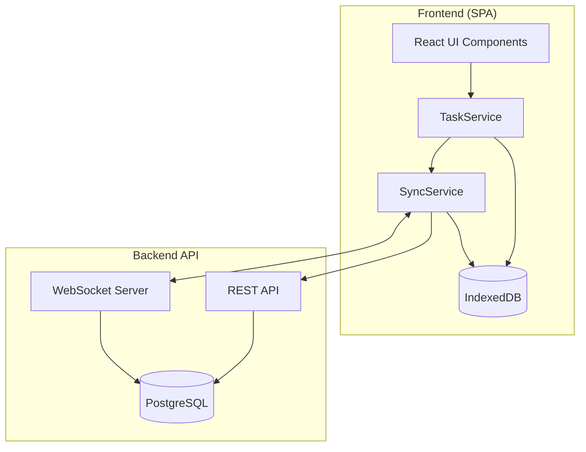
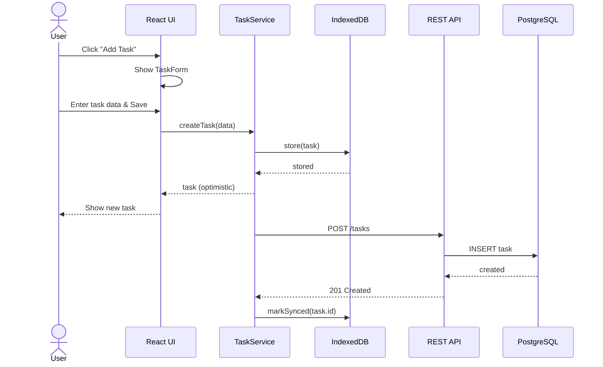

# Technical Design — Todo App

## 1. Architecture Overview

### 1.1 Architectural Vision

The Todo App follows a clean architecture approach with clear separation between presentation, business logic, and data layers. The frontend is built as a single-page application (SPA) communicating with a RESTful backend API.

The system prioritizes offline-first capabilities using local storage with background synchronization. This ensures users can work without interruption regardless of network conditions.

Event-driven architecture is employed for real-time updates and cross-device synchronization via WebSockets.

### 1.2 Architecture Drivers

#### Functional Drivers

| Requirement | Design Response |
|-------------|-----------------|
| `cpt-examples-todo-app-fr-create-task` | REST API endpoint POST /tasks with validation |
| `cpt-examples-todo-app-fr-complete-task` | PATCH /tasks/:id with status toggle |
| `cpt-examples-todo-app-fr-delete-task` | DELETE /tasks/:id endpoint with authorization |
| `cpt-examples-todo-app-fr-filter-tasks` | Query parameters on GET /tasks |
| `cpt-examples-todo-app-nfr-offline-support` | IndexedDB local storage with sync queue |

#### NFR Allocation

This table maps non-functional requirements from PRD to specific design/architecture responses, demonstrating how quality attributes are realized.

| NFR ID | NFR Summary | Allocated To | Design Response | Verification Approach |
|--------|-------------|--------------|-----------------|----------------------|
| `cpt-examples-todo-app-nfr-response-time` | UI interactions <200ms p95 | TaskService + IndexedDB | Local-first architecture: all reads from IndexedDB (sub-10ms), writes optimistic with background sync | Performance benchmarks measure p95 latency |
| `cpt-examples-todo-app-nfr-data-persistence` | Local persist <50ms, cloud sync <5s | SyncService + IndexedDB + REST API | IndexedDB for immediate local persistence; background WebSocket sync with retry queue | Integration tests verify timing + recovery scenarios |

### 1.3 Architecture Layers

| Layer | Responsibility | Technology |
|-------|---------------|------------|
| Presentation | User interface, user input handling | React, TailwindCSS |
| Application | Use case orchestration, DTOs | TypeScript services |
| Domain | Business logic, entities, validation | TypeScript classes |
| Infrastructure | Data persistence, external APIs | PostgreSQL, Redis |

## 2. Principles & Constraints

### 2.1 Design Principles

#### Offline-First

- [ ] `p2` - **ID**: `cpt-examples-todo-app-principle-offline-first`

**ADRs**: `cpt-examples-todo-app-adr-local-storage`

All operations must work without network connectivity. Data is persisted locally first, then synchronized to the server when connection is available.

#### Optimistic Updates

- [ ] `p2` - **ID**: `cpt-examples-todo-app-principle-optimistic-updates`

**ADRs**: `cpt-examples-todo-app-adr-optimistic-ui`

UI updates immediately on user action without waiting for server confirmation. Rollback occurs only on server rejection.

### 2.2 Constraints

#### Browser Compatibility

- [ ] `p2` - **ID**: `cpt-examples-todo-app-constraint-browser-compat`

**ADRs**: `cpt-examples-todo-app-adr-browser-support`

Application must support latest 2 versions of Chrome, Firefox, Safari, and Edge.

## 3. Technical Architecture

### 3.1 Domain Model

**Technology**: TypeScript

**Location**: [src/domain/entities](../src/domain/entities)

**Core Entities**:

| Entity | Description | Schema |
|--------|-------------|--------|
| Task | Core task entity with title, status, priority | [task.ts](../src/domain/entities/task.ts) |
| Category | Task grouping entity | [category.ts](../src/domain/entities/category.ts) |
| User | User account entity | [user.ts](../src/domain/entities/user.ts) |

**Relationships**:
- Task → Category: Many-to-one (task belongs to optional category)
- Task → User: Many-to-one (task belongs to user)
- Category → User: Many-to-one (category belongs to user)

### 3.2 Component Model

#### React UI

**ID**: `cpt-examples-todo-app-component-react-ui`

User interface rendering and input handling. Interface: React components, event handlers.

#### TaskService

**ID**: `cpt-examples-todo-app-component-task-service`

Business logic orchestration, CRUD operations. Interface: TypeScript async methods.

#### SyncService

**ID**: `cpt-examples-todo-app-component-sync-service`

Background synchronization, conflict resolution. Interface: Event-driven, queue-based.

#### IndexedDB

**ID**: `cpt-examples-todo-app-component-indexeddb`

Local data persistence. Interface: Dexie.js wrapper API.

#### REST API

**ID**: `cpt-examples-todo-app-component-rest-api`

Server-side task management. Interface: HTTP endpoints (see § 3.3).

#### WebSocket Server

**ID**: `cpt-examples-todo-app-component-websocket-server`

Real-time sync notifications. Interface: JSON messages.

#### PostgreSQL

**ID**: `cpt-examples-todo-app-component-postgresql`

Persistent data storage. Interface: SQL via backend.

**Interactions**:
- React UI → TaskService: Method calls for CRUD operations
- TaskService → IndexedDB: Local persistence (immediate)
- TaskService → SyncService: Queue sync operations
- SyncService ↔ WebSocket: Bidirectional real-time updates
- SyncService → REST API: HTTP requests for persistence

### 3.3 API Contracts

**Technology**: REST/OpenAPI

**Public interface**: `cpt-examples-todo-app-interface-rest-api`

**Location**: [api/openapi.yaml](../api/openapi.yaml)

**Endpoints Overview**:

| Method | Path | Description | Stability |
|--------|------|-------------|-----------|
| `GET` | `/tasks` | List tasks with optional filters | stable |
| `POST` | `/tasks` | Create a new task | stable |
| `GET` | `/tasks/:id` | Get task by ID | stable |
| `PATCH` | `/tasks/:id` | Update task fields | stable |
| `DELETE` | `/tasks/:id` | Delete a task | stable |

#### WebSocket Sync Protocol

- [x] `p1` - **ID**: `cpt-examples-todo-app-interface-websocket`

**Technology**: WebSocket + JSON
**Protocol**: Messages follow format: `{ type: "sync" | "update" | "delete", payload: Task }`
**References**: PRD `cpt-examples-todo-app-contract-sync`

#### IndexedDB Local Storage Interface

- [x] `p1` - **ID**: `cpt-examples-todo-app-interface-indexeddb`

**Technology**: Dexie.js (IndexedDB wrapper)
**Data Format**: Task objects with additional metadata (syncState, lastModified)

### 3.4 Internal Dependencies

No internal module dependencies — Todo App is a standalone module with no platform module consumers or providers.

| Dependency Module | Interface Used | Purpose |
|-------------------|---------------|--------|
| (none) | — | — |

### 3.5 External Dependencies

#### WebSocket Sync Backend

**Contract**: `cpt-examples-todo-app-interface-websocket`

**Type**: External API
**Direction**: bidirectional
**Protocol / Driver**: WebSocket + JSON; messages follow format: `{ type: "sync" | "update" | "delete", payload: Task }`
**Data Format**: JSON (follows Task model from `cpt-examples-todo-app-interface-task-model`)
**Compatibility**: Protocol version negotiated on connection; supports fallback to HTTP polling

#### IndexedDB (Browser Local Storage)

**Contract**: `cpt-examples-todo-app-interface-indexeddb`

**Type**: Database
**Direction**: bidirectional
**Protocol / Driver**: Dexie.js (IndexedDB wrapper) with indexes on userId, status, categoryId, dueDate
**Data Format**: Task objects stored as-is with additional metadata (syncState, lastModified)
**Compatibility**: Schema migrations handled by Dexie.js version upgrade hooks

#### PostgreSQL

- [x] `p1` - **ID**: `cpt-examples-todo-app-design-ext-postgresql`

**Type**: Database
**Direction**: outbound
**Protocol / Driver**: PostgreSQL driver via Express backend
**Data Format**: SQL (relational schema, see 3.7)
**Compatibility**: Schema migrations managed via migration tool

### 3.6 Interactions & Sequences

#### Create Task (Optimistic UI + Local Persistence + API Sync)

- [ ] `p1` - **ID**: `cpt-examples-todo-app-seq-create-task-v1`

Sequence showing how a new task is created with optimistic UI update, immediate IndexedDB persistence, and eventual server persistence via REST API.

**Use cases**: `cpt-examples-todo-app-usecase-create-task`

**Actors**: `cpt-examples-todo-app-actor-user`, `cpt-examples-todo-app-actor-sync-service`

### 3.7 Database schemas & tables

#### Table: tasks

**ID**: `cpt-examples-todo-app-design-db-tasks`

| Column | Type | Constraints | Description |
|--------|------|-------------|-------------|
| id | UUID | PK | Primary key |
| user_id | UUID | FK, NOT NULL | Foreign key to users |
| title | VARCHAR(255) | NOT NULL | Task title |
| description | TEXT | | Optional description |
| status | ENUM | NOT NULL, DEFAULT 'active' | 'active', 'completed' |
| priority | ENUM | NOT NULL | 'low', 'medium', 'high' |
| category_id | UUID | FK | Optional foreign key to categories |
| due_date | TIMESTAMP | | Optional due date |
| created_at | TIMESTAMP | NOT NULL | Creation timestamp |
| updated_at | TIMESTAMP | NOT NULL | Last update timestamp |

**Indexes**: user_id, status, due_date

**Notes**: status defaults to 'active' on insert

## 4. Additional Context

**ID**: `cpt-examples-todo-app-design-context-decisions`

The choice of React over other frameworks was driven by team expertise and ecosystem maturity. PostgreSQL was selected for its reliability and JSON support for flexible task metadata.

## 5. Traceability

- **PRD**: [PRD.md](./PRD.md)
- **ADRs**: [ADR/](./ADR/)
- **Features**: [features/](./features/)
