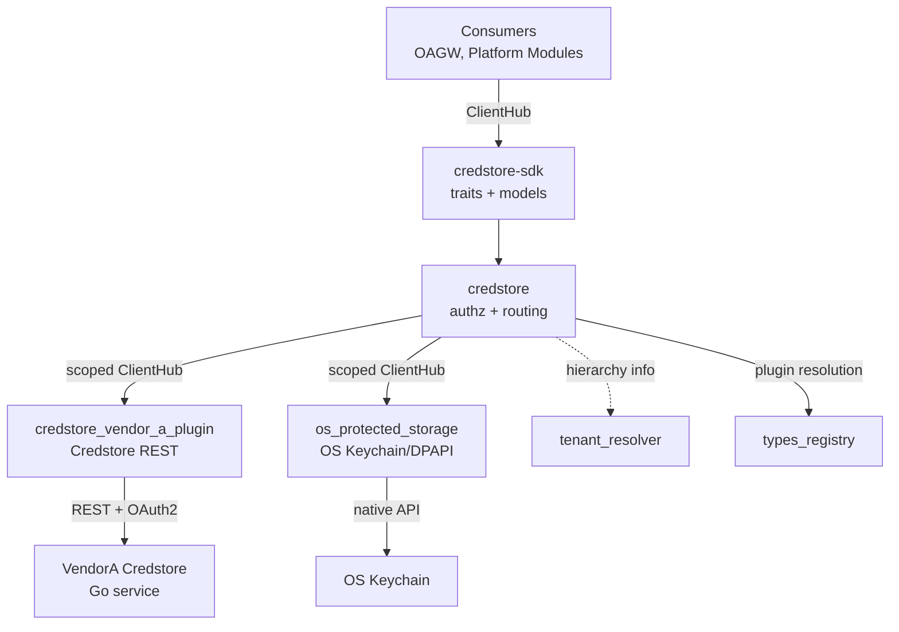
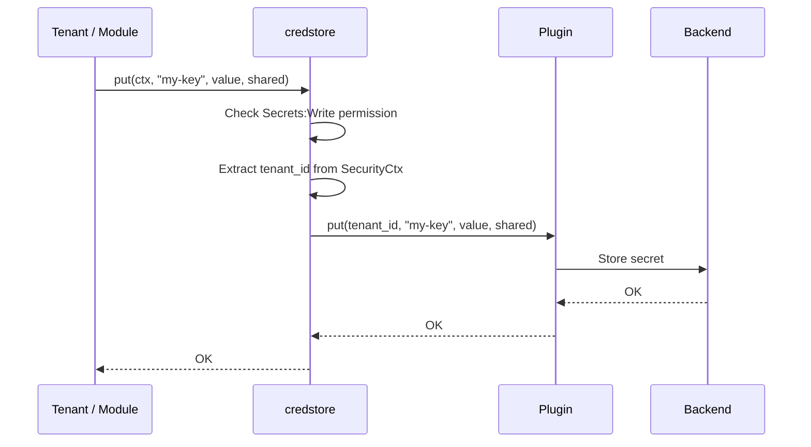
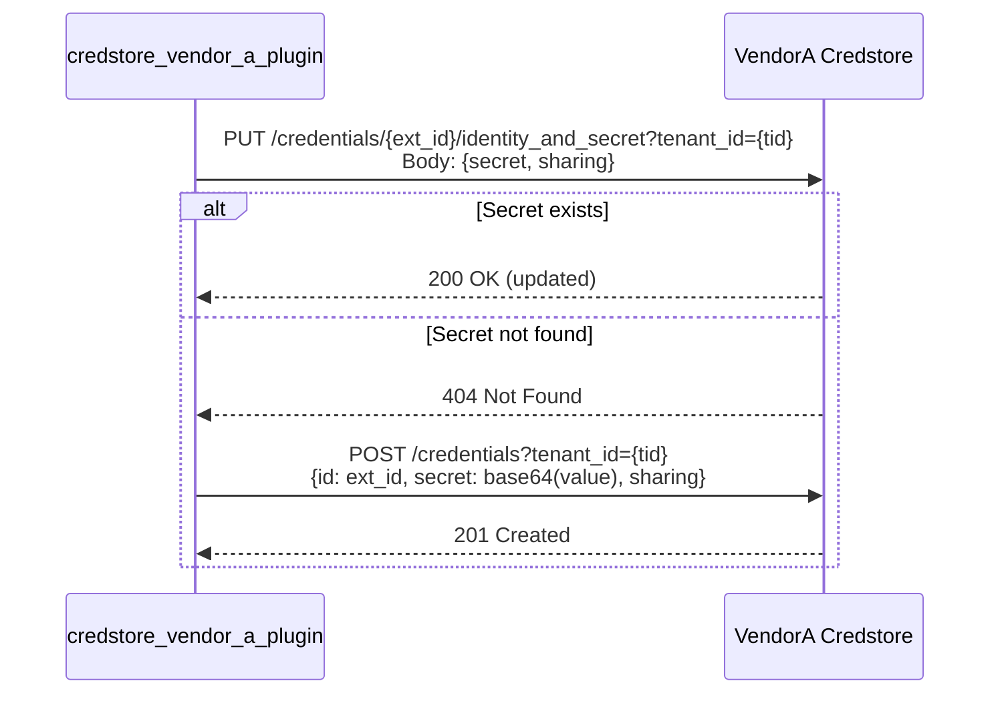
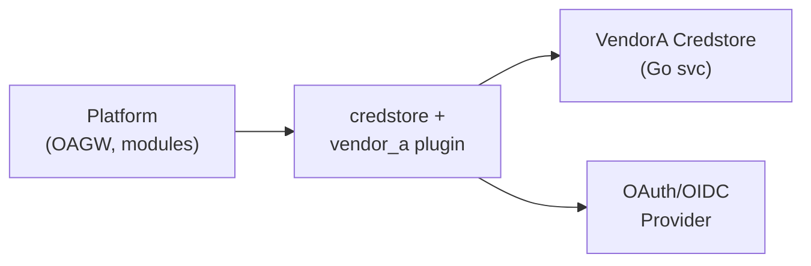
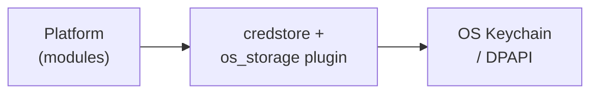

# Technical Design — CredStore

<!--
=============================================================================
TECHNICAL DESIGN DOCUMENT
=============================================================================
PURPOSE: Define HOW the system is built — architecture, components, APIs,
data models, and technical decisions that realize the requirements.

DESIGN IS PRIMARY: DESIGN defines the "what" (architecture and behavior).
ADRs record the "why" (rationale and trade-offs) for selected design
decisions; ADRs are not a parallel spec, it's a traceability artifact.

SCOPE:
  ✓ Architecture overview and vision
  ✓ Design principles and constraints
  ✓ Component model and interactions
  ✓ API contracts and interfaces
  ✓ Data models and database schemas
  ✓ Technology stack choices

NOT IN THIS DOCUMENT (see other templates):
  ✗ Requirements → PRD.md
  ✗ Detailed rationale for decisions → ADR/
  ✗ Step-by-step implementation flows → features/

STANDARDS ALIGNMENT:
  - IEEE 1016-2009 (Software Design Description)
  - IEEE 42010 (Architecture Description — viewpoints, views, concerns)
  - ISO/IEC 15288 / 12207 (Architecture & Design Definition processes)

ARCHITECTURE VIEWS (per IEEE 42010):
  - Context view: system boundaries and external actors
  - Functional view: components and their responsibilities
  - Information view: data models and flows
  - Deployment view: infrastructure topology

DESIGN LANGUAGE:
  - Be specific and clear; no fluff, bloat, or emoji
  - Reference PRD requirements using `cpt-cf-credstore-fr-{slug}` IDs
  - Reference ADR documents using `cpt-cf-credstore-adr-{slug}` IDs
=============================================================================
-->

## 1. Architecture Overview

### 1.1 Architectural Vision

CredStore follows the ModKit Gateway + Plugins pattern (same architecture as `tenant_resolver`). A gateway module (`credstore`) exposes a simple public API to platform consumers, enforces authorization policy, and implements hierarchical secret resolution. Backend-specific storage is implemented as plugins that register via the GTS type system and are selected at runtime by configuration.

The SDK crate (`credstore-sdk`) defines two trait boundaries: `CredStoreClient` for consumers and `CredStorePluginClient` for backend implementations. Consumers depend only on the gateway trait and never interact with plugins directly. This decoupling allows runtime backend selection without changing consumer code.

The architecture provides simple CRUD operations (get, put, delete) for tenant-scoped secrets. The tenant ID is always derived from SecurityCtx for self-service operations. Authorization is enforced exclusively in the gateway layer. **Hierarchical secret resolution** (the walk-up algorithm that searches for secrets across tenant ancestors) is implemented in the Gateway using `tenant_resolver` to query the tenant hierarchy. Plugins are pure storage adapters providing simple per-tenant key-value operations with no policy or hierarchical logic.

### 1.2 Architecture Drivers

#### Functional Drivers

| Requirement | Design Response |
|-------------|-----------------|
| `cpt-cf-credstore-fr-put-secret` | Plugin `put` with tenant_id, key, value, sharing → backend storage |
| `cpt-cf-credstore-fr-get-secret` | Plugin `get` with tenant_id, key, optional owner_id → backend lookup (two-phase: private then tenant/shared) |
| `cpt-cf-credstore-fr-delete-secret` | Plugin `delete` with tenant_id, key, optional owner_id → backend removal |
| `cpt-cf-credstore-fr-tenant-scoping` | Gateway extracts tenant_id from SecurityCtx before delegating to plugin |
| `cpt-cf-credstore-fr-sharing-modes` | `sharing` field in Credstore backend (VendorA); passed through from Gateway API |
| `cpt-cf-credstore-fr-authz-gateway` | Gateway checks SecurityCtx permissions before any plugin call |
| `cpt-cf-credstore-fr-rw-separation` | VendorA plugin configures separate RO/RW OAuth2 client credentials |

#### NFR Allocation

| NFR ID | NFR Summary | Allocated To | Design Response | Verification Approach |
|--------|-------------|--------------|-----------------|----------------------|
| `cpt-cf-credstore-nfr-confidentiality` | Secret values never in logs | Gateway + plugins | `SecretValue` wrapper type with custom `Debug`/`Display` that redacts content; log scrubbing at transport layer | Automated log scan in integration tests |

### 1.3 Architecture Layers

```
┌─────────────────────────────────────────────────────────────┐
│                    Consumers (OAGW, modules)                │
├─────────────────────────────────────────────────────────────┤
│  credstore-sdk    │ Public API traits, models, errors       │
├─────────────────────────────────────────────────────────────┤
│  credstore.       │ Authorization, plugin selection, REST   │
├─────────────────────────────────────────────────────────────┤
│  Plugins          │ Backend-specific storage adapters       │
│  ┌──────────────────────┐  ┌──────────────────────────────┐ │
│  │ credstore_vendor_a   │  │ os_protected_storage (P2)    │ │
│  │ (Credstore REST)     │  │ (macOS Keychain / Win DPAPI) │ │
│  └──────────────────────┘  └──────────────────────────────┘ │
├─────────────────────────────────────────────────────────────┤
│  External          │ VendorA Credstore, OS keychain         │
└─────────────────────────────────────────────────────────────┘
```

| Layer | Responsibility | Technology |
|-------|---------------|------------|
| SDK | Public and plugin trait definitions, models, errors | Rust crate (`credstore-sdk`) |
| Gateway | Authorization enforcement, hierarchical resolution, sharing mode enforcement, plugin resolution, REST API | Rust crate (`credstore`), Axum, tenant_resolver |
| Plugins | Backend-specific secret storage operations (simple per-tenant CRUD) | Rust crates, HTTP client / OS APIs |
| External | Secret persistence and encryption (no hierarchical logic) | VendorA Credstore (Go), OS keychain |

## 2. Goals / Non-Goals

### 2.1 Goals

The CredStore design aims to achieve the following objectives:

- Provide secure, hierarchical secret storage for platform modules and tenant administrators
- Enable flexible sharing modes: `private` (owner-only), `tenant` (tenant-wide, default), `shared` (hierarchical)
- Support service-to-service secret retrieval (e.g., OAGW retrieving secrets on behalf of customer tenants)
- Implement authorization and hierarchical resolution in Gateway module (centralized policy enforcement)
- Support multiple backend storage options via plugin architecture (VendorA Credstore, OS keychain)
- Ensure secret values never appear in logs, error messages, or debug traces
- Provide simple CRUD operations with clear REST semantics
- Enable secret shadowing: child tenants can override parent credentials without breaking existing references

### 2.2 Non-Goals

The following capabilities are explicitly out of scope for v1:

- **Granular ACL beyond hierarchical**: Fine-grained access control (role-based, attribute-based, per-secret ACLs) is out of scope. The three-tier sharing model covers primary use cases. Future enhancement documented in PRD Open Questions.
- **Secret versioning / history**: Versioned secrets, version rollback, or secret history tracking is out of scope.
- **Secret rotation automation**: Automatic secret rotation, expiration, or lifecycle management is out of scope.
- **Direct end-user access**: Unauthenticated or untrusted client access (e.g., browser-based secret retrieval without platform authentication) is out of scope.
- **Secret templates or composition**: Dynamic secret generation, composition from templates, or secret derivation is out of scope.
- **Hierarchical resolution in Backend**: Backends provide simple per-tenant key-value storage only. All hierarchical walk-up logic, sharing mode enforcement, and policy decisions are in Gateway.
- **Secret discovery / search**: Listing all secrets, searching by tags, or full-text search across secret values is out of scope for v1.

## 3. Principles & Constraints

### 3.1 Design Principles

#### Authorization in Gateway

- [ ] `p1` - **ID**: `cpt-cf-credstore-principle-authz-gateway`

Authorization (permission checks for `Secrets:Read` and `Secrets:Write`) is enforced exclusively in the gateway layer. Plugins are "storage adapters" that delegate to backends and MUST NOT implement authorization or policy decisions. This prevents inconsistent behavior across backends.

**Note**: The Gateway also implements sharing mode enforcement (determining which secrets are accessible based on `private`/`tenant`/`shared` modes during hierarchical resolution). This is part of the Gateway's policy layer, distinct from the Backend's simple per-tenant storage semantics.

#### Stateless Key Mapping

- [ ] `p1` - **ID**: `cpt-cf-credstore-principle-stateless-mapping`

The VendorA Credstore plugin uses a deterministic, stateless mapping from `(tenant_id, key, optional owner_id)` to Credstore ExternalID. Private secrets include `owner_id` in the mapping to support per-owner namespacing. No local mapping database is required. This simplifies operations and eliminates a failure mode.

#### Tenant from SecurityCtx

- [ ] `p1` - **ID**: `cpt-cf-credstore-principle-tenant-from-ctx`

For self-service operations, the tenant is always derived from `SecurityCtx.tenant_id()`. This reduces API surface, prevents misuse, and aligns with existing platform patterns (consistent with `tenant_resolver`).

### 3.2 Constraints

#### OAuth2 for Credstore

- [ ] `p1` - **ID**: `cpt-cf-credstore-constraint-oauth2`

All Credstore REST calls require OAuth2 client credentials authentication. Token acquisition and caching are handled by a shared `oauth_token_provider` component.

#### No Secret Logging

- [ ] `p1` - **ID**: `cpt-cf-credstore-constraint-no-secret-logging`

Secret values MUST NOT appear in any log output, error messages, or debug traces. The `SecretValue` type implements `Debug` and `Display` with redacted output.

## 4. Technical Architecture

### 4.1 Domain Model

**Technology**: Rust structs

**Core Entities**:

| Entity | Description |
|--------|-------------|
| `SecretRef` | Human-readable key identifying a secret (e.g., `partner-openai-key`). **Format**: `[a-zA-Z0-9_-]+`, max 255 chars. Colons prohibited to prevent ExternalID collisions. |
| `SecretValue` | Opaque byte wrapper for decrypted secret data. Custom `Debug`/`Display` that redacts content. |
| `SharingMode` | Enum: `Private`, `Tenant` (default), `Shared` — controls access scope within tenant hierarchy |
| `OwnerId` | UUID identifying the creator (from `SecurityContext.subject_id()`) — used for owner-only access control in `Private` mode |
| `SecretMetadata` | Struct containing secret value and access control metadata: `{ value: SecretValue, owner_id: OwnerId, sharing: SharingMode, owner_tenant_id: TenantId }` |

**Relationships**:
- A Secret belongs to exactly one Tenant (via `tenant_id`)
- A Secret has exactly one Owner (via `owner_id`) — the actor that created it
- **Uniqueness**: For `tenant` and `shared` modes, `(tenant_id, reference)` is unique — one non-private secret per key per tenant. For `private` mode, `(tenant_id, reference, owner_id)` is unique — each owner can have their own private secret with the same reference. A tenant can simultaneously hold one tenant/shared secret and multiple private secrets (one per owner) under the same reference.
- `ResolveResult` references the owning tenant (which may differ from the requesting tenant)

**Sharing Mode Access Control**:
- **`Private`**: Secret metadata includes `owner_id` (populated from `SecurityContext.subject_id()`). Access checks verify `owner_id == current_subject_id` AND tenant match.
- **`Tenant`**: `owner_id` is stored for audit trail but not enforced during access checks. Any user/service in the owning tenant can access.
- **`Shared`**: `owner_id` is stored for audit trail. Hierarchical tenant resolution applies (current behavior).

### 4.2 Component Model



**Components**:

- [ ] `p1` - **ID**: `cpt-cf-credstore-component-sdk`

`credstore-sdk` — Trait definitions, models, error types. Interfaces: `CredStoreClient`, `CredStorePluginClient`.

- [ ] `p1` - **ID**: `cpt-cf-credstore-component-gateway`

`credstore` — Authorization, hierarchical resolution (walk-up algorithm), sharing mode enforcement, plugin selection, REST endpoints. Interfaces: Axum routes, ClientHub registration, tenant_resolver queries.

- [ ] `p1` - **ID**: `cpt-cf-credstore-component-vendor-a-plugin`

`credstore_vendor_a_plugin` — VendorA Credstore REST integration (simple per-tenant CRUD). Interfaces: HTTP client, ExternalID mapping.

- [ ] `p2` - **ID**: `cpt-cf-credstore-component-os-protected-storage`

`os_protected_storage` — OS keychain integration (P2) — simple per-tenant CRUD. Interfaces: Platform-native secure storage APIs.

**Interactions**:
- Consumer → Gateway: via `CredStoreClient` trait through ClientHub
- Gateway → Plugin: via `CredStorePluginClient` trait through scoped ClientHub (GTS instance ID)
- Gateway → tenant_resolver: queries tenant ancestry chain for hierarchical secret resolution walk-up
- VendorA Plugin → Credstore: HTTP REST with OAuth2 bearer token (simple per-tenant CRUD operations)
- VendorA Plugin → OAuth provider: token acquisition and caching

### 4.3 API Contracts

- [ ] `p1` - **ID**: `cpt-cf-credstore-interface-vendor-a-rest`

**Technology**: REST/OpenAPI + Rust traits (ClientHub)

#### ClientHub API (in-process)

`CredStoreClient` trait (public API for consumers):

| Method | Signature | Description |
|--------|-----------|-------------|
| `get` | `(ctx: &SecurityCtx, key: &SecretRef) → Result<Option<SecretValue>>` | Retrieve own secret |
| `put` | `(ctx: &SecurityCtx, key: &SecretRef, value: SecretValue, sharing: SharingMode) → Result<()>` | Create or update secret with sharing mode |
| `delete` | `(ctx: &SecurityCtx, key: &SecretRef) → Result<()>` | Delete own secret |

`CredStorePluginClient` trait (backend adapter interface):

| Method | Signature | Description |
|--------|-----------|-------------|
| `get` | `(tenant_id: &TenantId, key: &SecretRef, owner_id: Option<&OwnerId>) → Result<Option<SecretMetadata>>` | Get secret from backend. If `owner_id` is `Some`, looks up the private secret for that owner; if `None`, looks up the tenant/shared secret. |
| `put` | `(tenant_id: &TenantId, key: &SecretRef, value: SecretValue, sharing: SharingMode, owner_id: OwnerId) → Result<()>` | Store secret in backend. ExternalID is derived from sharing mode and owner_id (see ExternalID Mapping). |
| `delete` | `(tenant_id: &TenantId, key: &SecretRef, owner_id: Option<&OwnerId>) → Result<()>` | Delete secret from backend. If `owner_id` is `Some`, deletes the private secret for that owner; if `None`, deletes the tenant/shared secret. |

**SecretMetadata structure**:
```rust
struct SecretMetadata {
    value: SecretValue,
    owner_id: OwnerId,
    sharing: SharingMode,
    owner_tenant_id: TenantId,  // Tenant that owns this secret
}
```

**Design Rationale**: The Plugin must return metadata (owner_id, sharing, owner_tenant_id) so the Gateway can:
1. Enforce sharing mode rules during hierarchical resolution (tenant vs shared access checks)
2. Populate response metadata (`is_inherited`, `owner_tenant_id`) for clients

For `private` secrets, owner match is guaranteed by ExternalID construction (owner_id is baked into the ExternalID), so no additional access check is needed. For `tenant`/`shared` secrets, the Gateway uses the returned metadata to enforce access control.

#### 4.3.1 REST API (Gateway)

| Method | Path | Description | Stability |
|--------|------|-------------|-----------|
| `POST` | `/api/credstore/v1/secrets` | Create secret with sharing mode | stable |
| `PUT` | `/api/credstore/v1/secrets/{ref}` | Update secret value and/or sharing mode | stable |
| `GET` | `/api/credstore/v1/secrets/{ref}` | Get own secret value | stable |
| `DELETE` | `/api/credstore/v1/secrets/{ref}` | Delete own secret | stable |

**Create Secret Request:**
```json
{
  "reference": "partner-openai-key",
  "value": "demo-secret-value-123",
  "sharing": "tenant"
}
```

**Sharing mode values**: `"private"` (owner-only), `"tenant"` (tenant-wide, default), `"shared"` (hierarchical)

**Get Secret Response (200 OK):**
```json
{
  "value": "demo-secret-value-456",
  "metadata": {
    "owner_tenant_id": "partner-acme",
    "sharing": "shared",
    "is_inherited": true
  }
}
```

**Response Metadata Fields**:
- `owner_tenant_id`: The tenant that owns this secret (may differ from requesting tenant if inherited)
- `sharing`: The sharing mode (`private`, `tenant`, `shared`)
- `is_inherited`: `true` if secret was retrieved from an ancestor via hierarchical resolution, `false` if owned by requesting tenant

**Use case**: Child tenants can see that a secret is inherited and can be shadowed by creating their own secret with the same reference.

**Update Secret Request:**
```json
{
  "value": "updated-demo-value-789",
  "sharing": "shared"
}
```

**Error Responses:**

| Status | Error Type | Scenario |
|--------|-----------|----------|
| 401 | Unauthorized | Invalid or missing token |
| 403 | AccessDenied | Insufficient permissions (`Secrets:Read` or `Secrets:Write` missing) |
| 404 | NotFound | Secret not found OR inaccessible (owner mismatch, private/tenant scope mismatch, not in hierarchy). **Security**: Always return 404 for inaccessible secrets to prevent enumeration attacks. |
| 409 | Conflict | Secret with this reference already exists within the same scope (POST create-only endpoint). Private secrets are scoped per-owner, so different owners never conflict. |
| 500 | InternalError | Backend or encryption errors |

### 4.4 External Interfaces & Protocols

#### VendorA Credstore REST API

**Type**: External System

**Direction**: outbound

**Data Format**: JSON over HTTP/REST

**Authentication**: OAuth2 client credentials (token acquired via shared `oauth_token_provider`)

**Endpoints used:**

| Operation | Credstore Endpoint | Notes |
|-----------|-------------------|-------|
| Read | `GET /credentials/{external_id}?tenant_id={tid}&include_secret=true` | Returns secret value. 404 → `None` |
| Write (update) | `PUT /credentials/{external_id}/identity_and_secret?tenant_id={tid}` | Updates secret value. If 404, fall through to create |
| Write (create) | `POST /credentials?tenant_id={tid}` | Body includes `id=external_id`, `secret=<base64>`, `sharing` field, `owner_id` field |
| Delete | `DELETE /credentials/{external_id}?tenant_id={tid}` | Removes credential |

**Sharing Mode Field**: The `sharing` field is stored in Credstore backend as metadata. Values: `private` (owner-only), `tenant` (tenant-wide), `shared` (hierarchical). The Gateway reads this field and enforces access control during hierarchical resolution. The Backend provides simple per-tenant storage without hierarchical logic.

**Owner ID Field**: The `owner_id` field (UUID) is stored in Credstore backend and identifies the creator (from `SecurityContext.subject_id()`). For `private` mode, access checks must verify `owner_id` matches the requesting subject. For `tenant` and `shared` modes, `owner_id` is stored for audit trail but not enforced in access checks.

**Compatibility Note**: VendorA Credstore backend schema must support:
1. Three-value `sharing` enum: `private`, `tenant`, `shared`
2. `owner_id` UUID field for creator identification
The VendorA Credstore backend must support these fields before deployment. Backend schema/feature implementation is a prerequisite for launching the credstore module.

**ExternalID Mapping:**
```
# Tenant/Shared secrets (one per tenant+key):
raw         = "{tenant_id}:{key}"
external_id = base64url_no_pad(raw) + "@secret"

# Private secrets (one per tenant+key+owner):
raw         = "{tenant_id}:{key}:p:{owner_id}"
external_id = base64url_no_pad(raw) + "@secret"
```

The plugin derives the ExternalID variant from the `sharing` mode (on `put`) or from the `owner_id` parameter (on `get`/`delete`): `Some(owner_id)` → private variant, `None` → tenant/shared variant.

This deterministic, stateless mapping avoids maintaining a local mapping database and achieves idempotent operations.

**Collision Prevention**: SecretRef format is constrained to `[a-zA-Z0-9_-]+` (no colons) to prevent collisions. Tenant_id is a UUID (no colons), owner_id is a UUID (no colons), and colons serve as delimiters. The `:p:` segment distinguishes private ExternalIDs from tenant/shared ones, ensuring each `(tenant_id, key, scope)` tuple maps to a unique ExternalID.

**Compatibility**: Plugin adapts to Credstore API version. ExternalID format must remain stable across versions to avoid breaking lookups.

#### Sharing Mode Transitions (Constraints & Plugin Capabilities)

The API exposes `sharing` as a field that can be set on `put` / `update`, but not all "sharing transitions" are equivalent at the storage layer.

Because secret identity differs between private and non-private secrets (via ExternalID mapping), transitions fall into two classes:

- **`tenant` ↔ `shared` (non-private)**: Same ExternalID (`{tenant_id}:{key}`) and can be implemented as an in-place metadata update *if* the backend supports updating `sharing` on an existing record.
- **`private` ↔ (`tenant`/`shared`)**: Different ExternalIDs (`{tenant_id}:{key}:p:{owner_id}` vs `{tenant_id}:{key}`), so a "conversion" cannot be a single in-place update. A portable implementation requires creating a new record in the target scope and (optionally) deleting the old one; this is not atomic.

This has two practical implications:

- **Plugin/backend capability**: Whether a given backend can support a specific transition (especially private ↔ non-private) is a plugin/backing-store capability and may be restricted in v1.
- **No implicit migration guarantee**: If a client updates `sharing` across the private/non-private boundary, the system MUST NOT assume an atomic "move". Implementations should document whether they perform a best-effort two-step migrate (create + delete) or instead reject such transitions.

### 4.5 Service-to-Service Pattern

#### Architecture Pattern

The CredStore Gateway supports two distinct integration patterns:

1. **Self-Service Pattern**: Platform modules and tenant admins retrieve secrets for their own tenant. The tenant_id is derived from SecurityCtx.
2. **Service-to-Service Pattern**: Authorized service accounts (e.g., OAGW) retrieve secrets on behalf of arbitrary tenants by constructing an explicit SecurityCtx with the target tenant_id.

#### Service-to-Service Flow (OAGW Example)

**Actor**: `cpt-cf-credstore-actor-oagw` (Outbound API Gateway)

**Use Case**: OAGW needs to retrieve a partner's shared API key when making an upstream call on behalf of a customer tenant.

**Flow**:
1. **SecurityCtx Construction**: OAGW constructs a SecurityCtx with:
   - `tenant_id`: Target tenant (e.g., `customer-123`)
   - `subject_id`: OAGW service account ID
   - `permissions`: `Secrets:Read` permission for the service account
2. **Gateway Invocation**: OAGW calls Gateway's standard `get(ctx, key)` operation (same API as self-service)
3. **Authorization**: Gateway verifies:
   - Service account has `Secrets:Read` permission
   - Service account is authorized to construct SecurityCtx with arbitrary tenant_id (service-level authorization)
4. **Hierarchical Resolution**: Gateway extracts `tenant_id` from SecurityCtx and performs hierarchical walk-up:
   - Queries `tenant_resolver` for ancestor chain
   - Walks up hierarchy calling Plugin `get` at each level
   - Checks sharing mode and owner_id for access control
   - Returns first accessible secret
5. **Response**: Gateway returns secret value and metadata to OAGW

**Key Differences from Self-Service**:
- **Tenant Derivation**: Explicit tenant_id in SecurityCtx (not derived from authenticated user)
- **Authorization**: Service account must be authorized for cross-tenant access
- **Use Case**: Service acts on behalf of another tenant (delegation pattern)
- **Auditing**: Audit trail must record both service account ID and target tenant_id

**Design Rationale**:
- **Unified API**: Both patterns use the same Gateway `get` operation (no separate service-to-service endpoint)
- **Security**: Service authorization is enforced at Gateway layer before hierarchical resolution
- **Transparency**: Hierarchical resolution is identical for both patterns (implemented in Gateway)
- **Flexibility**: Service accounts can retrieve secrets for any tenant they're authorized to access

**Implementation Note**: OAGW is a ModKit module that uses the standard CredStore SDK client. There is no separate integration path or direct backend access. All operations flow through Gateway→Plugin→Backend.

### 4.6 Interactions & Sequences

#### Self-Service CRUD (put example)

- [ ] `p1` - **ID**: `cpt-cf-credstore-seq-self-service-crud`



#### Write Flow (VendorA Credstore — upsert)

- [ ] `p1` - **ID**: `cpt-cf-credstore-seq-vendor-a-write`



**Key Flows**: Reference use cases from PRD:
- `cpt-cf-credstore-usecase-create-shared` → Self-Service CRUD (with `sharing: shared`)
- `cpt-cf-credstore-usecase-crud` → Self-Service CRUD
- `cpt-cf-credstore-usecase-hierarchical-resolve` → Hierarchical resolution implemented in Gateway module

**Hierarchical Resolution Implementation**: The Gateway module implements a two-phase walk-up algorithm:
1. Extract `tenant_id` and `subject_id` from SecurityCtx
2. Query `tenant_resolver` to get ancestor chain (child → parent → ... → root)
3. For each tenant in the chain (starting from requesting tenant), perform two-phase lookup:
   - **Phase 1 — Private**: Call Plugin `get(tenant_id, key, Some(subject_id))` to look up a private secret for this owner
     - If found and `sharing == private`: owner match is guaranteed by ExternalID construction → return secret value
   - **Phase 2 — Tenant/Shared**: Call Plugin `get(tenant_id, key, None)` to look up the tenant/shared secret
     - If found, check `sharing` mode for access control:
       - **`tenant` mode**: Check `metadata.owner_tenant_id == ctx.tenant_id()`
       - **`shared` mode**: Allow if requester is descendant or same tenant as owner_tenant_id
     - If accessible, return secret value + response metadata (owner_tenant_id, sharing, is_inherited)
   - If neither phase yields an accessible secret, continue to next ancestor
4. If no accessible secret found in entire chain, return NotFound

**Two-Phase Rationale**: Private secrets are stored under a separate ExternalID (`{tenant_id}:{key}:p:{owner_id}`), so a single `get` call cannot return both private and tenant/shared secrets. The Gateway always tries the caller's private secret first (phase 1), then falls back to the tenant/shared secret (phase 2). This costs at most 2 plugin calls per tenant in the chain.

**Shadowing Semantics**: When the requesting tenant has secrets with the same reference:
- **Private secret exists for this owner**: Return it immediately (phase 1 hit) — ancestor never checked
- **No private secret, but tenant/shared secret exists and is accessible**: Return it (phase 2 hit) — ancestor never checked
- **Neither phase yields an accessible secret**: Continue walk-up to ancestors

**Example**: User B in tenant X requests `key1`:
- Tenant X has `key1` with `sharing: private, owner_id: UserA` (stored under UserA's ExternalID)
- User B has no private `key1` in tenant X
- Tenant X has no tenant/shared `key1`
- Parent Y has `key1` with `sharing: shared` (accessible to descendants)
- Result: Phase 1 for X → miss (no private secret for User B). Phase 2 for X → miss (no tenant/shared). Move to parent Y → phase 2 hit → return parent's shared secret.

This allows User B to access the parent's shared credential. Meanwhile, User A in tenant X would get their own private `key1` (phase 1 hit).

### 4.7 Database schemas & tables

No local database. Secrets are persisted in the external backend (VendorA Credstore or OS keychain). The gateway and plugins are stateless.

### 4.8 Deployment Topology

**Kubernetes Environment:**



**Desktop/VM Environment (P2):**



### 4.9 Technology Stack

| Layer | Technology | Rationale |
|-------|------------|-----------|
| Gateway | Axum (REST), ModKit module macro | Platform standard for HTTP services |
| VendorA Plugin | `modkit-http` (`HttpClient`) | Platform-standard HTTP client with OAuth2 support |
| OAuth2 | Shared `oauth_token_provider` component | Centralized token acquisition and caching |
| OS Plugin (P2) | `keyring` crate or platform-native FFI | Cross-platform OS keychain access |
| Serialization | `serde` | Platform standard |
| Errors | `thiserror` | Platform standard |

## 5. Risks / Trade-offs

### 5.1 Architectural Trade-offs

#### Hierarchical Resolution in Gateway (not Backend)

**Decision**: Implement hierarchical walk-up algorithm in Gateway module, not in VendorA Credstore backend.

**Trade-offs**:
- ✅ **Pro**: Centralized policy enforcement — all sharing mode logic and access control is in one place
- ✅ **Pro**: Backend remains simple — just per-tenant key-value storage, easier to maintain and test
- ✅ **Pro**: Plugin portability — OS keychain plugin doesn't need to understand hierarchy
- ✅ **Pro**: Easier to change hierarchy logic without backend changes
- ❌ **Con**: Multiple backend calls during walk-up (N calls for N-deep hierarchy)
- ❌ **Con**: Gateway must query tenant_resolver for hierarchy information

**Mitigation**: Cache tenant hierarchy queries in Gateway; implement early termination on first accessible secret.

#### Three-Tier Sharing Model (not RBAC/ABAC)

**Decision**: Use simple three-tier sharing modes (private/tenant/shared) instead of granular ACL.

**Trade-offs**:
- ✅ **Pro**: Simple to understand and reason about
- ✅ **Pro**: Covers 90% of use cases (owner-only keys, team credentials, hierarchical platform creds)
- ✅ **Pro**: Easy to implement and test
- ❌ **Con**: Cannot express complex policies (e.g., "only billing team in tenant can access")
- ❌ **Con**: No role-based access control within tenant

**Mitigation**: Future enhancement for granular ACL is documented in PRD Open Questions.

#### 404 for Inaccessible Secrets (not 403)

**Decision**: Return 404 NotFound for all inaccessible secrets (owner-mismatch, private/tenant scope mismatch, not in hierarchy).

**Trade-offs**:
- ✅ **Pro**: Prevents enumeration attacks — attackers cannot probe for secret existence
- ✅ **Pro**: Simpler client logic — 404 means "not available"
- ❌ **Con**: Harder to debug — cannot distinguish "doesn't exist" from "no access"
- ❌ **Con**: Less RESTful (REST semantics prefer 403 for permission denied)

**Mitigation**: Audit logs record access attempts for debugging; error messages to admin users can be more detailed.

#### PUT-as-Upsert (not POST create + PUT update)

**Decision**: Use PUT /secrets/{ref} for create-or-update (idempotent upsert).

**Trade-offs**:
- ✅ **Pro**: Idempotent — clients can retry safely
- ✅ **Pro**: Simpler client usage — no need to check if secret exists first
- ✅ **Pro**: Reduces API surface (one endpoint vs two)
- ❌ **Con**: Less RESTful (POST typically for create, PUT for update)
- ❌ **Con**: Cannot detect accidental overwrites (no "create only" option)

**Mitigation**: POST /secrets endpoint available for explicit create-with-conflict-detection if needed.

### 5.2 Security and Performance Risks

#### Risk: Secret Values Leaked Through Logs

**Impact**: Critical security incident, compliance violations, potential credential theft

**Mitigation**:
- `SecretValue` type with redacted `Debug`/`Display` implementation
- Code review enforcement
- Log scrubbing at transport layer
- Automated log scanning in integration tests
- NFR requirement (`cpt-cf-credstore-nfr-confidentiality`)

**Likelihood**: Medium | **Impact**: Critical | **Priority**: P1

#### Risk: Hierarchy Walk-up Performance at Deep Nesting

**Impact**: Increased latency for secret resolution in deeply nested tenant hierarchies (10+ levels)

**Mitigation**:
- Early termination: stop walk-up on first accessible secret
- Cache tenant hierarchy queries from tenant_resolver
- Monitor resolution depth and latency metrics
- Consider future optimization: backend-side hierarchy resolution if performance becomes critical

**Likelihood**: Low | **Impact**: Medium | **Priority**: P2

#### Risk: Credstore API Changes Break Plugin

**Impact**: Plugin stops working, secrets become inaccessible, platform outage

**Mitigation**:
- Pin VendorA Credstore API version in plugin
- Integration tests against Credstore (run in CI)
- Version compatibility matrix documented
- Plugin adapts to API changes with feature flags or version detection

**Likelihood**: Medium | **Impact**: High | **Priority**: P1

#### Risk: ExternalID Encoding Collision

**Impact**: Wrong secret returned, data corruption, security incident

**Mitigation**:
- Deterministic base64url encoding with no-padding
- SecretRef format validation: `[a-zA-Z0-9_-]+` (no colons)
- Tenant ID is UUID (no colons)
- Comprehensive test coverage for edge cases
- Documented encoding algorithm

**Likelihood**: Very Low | **Impact**: Critical | **Priority**: P1

#### Risk: Owner ID Migration for Existing Secrets

**Impact**: Existing secrets without owner_id cannot be accessed in `private` mode

**Mitigation**:
- Migration script to backfill owner_id for existing secrets (default to tenant admin)
- Backward compatibility: if owner_id is null, treat as `tenant` mode
- Phased rollout: new secrets get owner_id, existing secrets migrated gradually

**Likelihood**: High | **Impact**: Medium | **Priority**: P1

## 6. Migration Plan

### 6.1 Schema Migration: Two-Mode to Three-Mode Sharing

**Background**: The current design introduces a three-tier sharing model (`private`/`tenant`/`shared`) replacing the previous two-mode system. The new `private` mode (owner-only) is more restrictive than the old `private` mode (tenant-wide).

**Migration Strategy**:

#### Phase 1: Backend Schema Update (VendorA Credstore)

1. **Add `owner_id` field** to Credstore schema:
   - Type: UUID
   - Nullable: YES (for backward compatibility with existing secrets)
   - Default: NULL
   - Index: Add index on (tenant_id, owner_id) for owner-based queries

2. **Extend `sharing` enum** from 2 values to 3:
   - Old values: `private`, `shared`
   - New values: `private` (owner-only), `tenant` (tenant-wide), `shared` (hierarchical)
   - Migration: Map old `private` → new `tenant`, old `shared` → new `shared`

3. **Backfill `owner_id` for existing secrets**:
   - Strategy: Set owner_id to tenant admin or service account for existing secrets
   - Alternative: Leave owner_id as NULL and treat NULL as `tenant` mode (accessible to all in tenant)

#### Phase 2: Gateway and Plugin Update

1. **Update `credstore_vendor_a_plugin`**:
   - Update PUT/POST calls to include `owner_id` field
   - Update GET response parsing to extract `owner_id` from backend
   - Handle NULL `owner_id` (treat as `tenant` mode)

2. **Update `credstore` Gateway**:
   - Update hierarchical resolution algorithm to check `owner_id` for `private` mode
   - Update PUT/POST operations to capture `owner_id` from SecurityContext.subject_id()
   - Update error handling to return 404 for owner-mismatch

3. **Update `credstore-sdk`**:
   - Update API contracts to include `owner_id` in SecretMetadata
   - Update sharing mode enum to three values

#### Phase 3: Client Migration

1. **Inform consumers** about new sharing mode semantics:
   - Old `private` mode behavior is now `tenant` mode
   - New `private` mode is owner-only (more restrictive)
   - Existing secrets with old `private` will be migrated to new `tenant`

2. **Provide migration guide** for consumers to update sharing modes if needed

3. **Backward compatibility**:
   - Gateway accepts both old and new sharing mode values
   - API defaults to `tenant` mode if sharing not specified

#### Phase 4: Rollout

1. **Deploy backend schema changes** (VendorA Credstore update)
2. **Deploy Gateway and Plugin updates** (with backward compatibility)
3. **Run migration script** to backfill owner_id and update sharing values
4. **Monitor** for errors and performance issues
5. **Gradually deprecate** old two-mode sharing values in API (future release)

### 6.2 Backward Compatibility

- **API**: Gateway accepts old sharing mode values and maps them to new values
- **Defaults**: Secrets created without `owner_id` are treated as `tenant` mode
- **Clients**: No breaking changes to existing client code (old behavior preserved under new `tenant` mode)

### 6.3 Rollback Plan

If migration fails:
1. **Revert Gateway and Plugin** to previous version
2. **Keep backend schema changes** (owner_id and new sharing enum are additive)
3. **Use feature flag** to disable three-tier sharing mode enforcement

### 6.4 Success Criteria

- ✅ All existing secrets remain accessible after migration
- ✅ New secrets can be created with all three sharing modes
- ✅ Owner-only access control works for `private` mode
- ✅ No performance degradation in hierarchical resolution
- ✅ Zero downtime during rollout

## 7. Open Questions

This section cross-references open questions from [PRD.md Section 13](./PRD.md#13-open-questions) and adds design-specific questions.

### 7.1 From PRD (Cross-Reference)

All open questions below are documented in detail in PRD.md Section 13 (lines 605-609).

1. **Batch Retrieval**: Should `resolve` support batch retrieval (multiple references in one call) for OAGW efficiency?
   - **Design Impact**: Would require new API endpoint `POST /secrets/batch` with array of SecretRef inputs

2. **P2/Future - Human vs Service Access**: Should human users be restricted from retrieving raw secret values for inherited shared secrets, while service accounts can?
   - **Design Impact**: Requires distinguishing human vs service authentication in SecurityCtx; separate authorization rules; metadata-only response for humans

3. **P2/Future - Audit Trails**: All credential operations should leave audit trails (timestamps, actor, tenant, outcome) with tamper-evident storage
   - **Design Impact**: New audit module; event emission from Gateway; secure log storage; never log plaintext secret values

4. **P2/Future - Schema Validation**: Should  secrets support JSON schema validation (using GTS)?
   - **Design Impact**: Schema registry; validation hooks in Gateway put operation; structured secret storage

5. **P2/Future - Compare-and-Swap (CAS)**: Should secret updates support atomic CAS validation?
   - **Design Impact**: Optional `expected_value` parameter in PUT operation; use VendorA Credstore CAS endpoint

### 7.2 Design-Specific Questions

6. **Plugin Failure Handling**: If a plugin call fails during hierarchical walk-up (e.g., network timeout), should Gateway:
   - Option A: Fail entire request (fail-fast)
   - Option B: Continue to next ancestor (best-effort)
   - Option C: Cache last-known value (eventual consistency)
   - **Recommendation**: Option A (fail-fast) for consistency; revisit if reliability issues emerge

7. **Tenant Hierarchy Caching**: Should Gateway cache tenant_resolver hierarchy queries?
   - **Design Impact**: In-memory cache with TTL; invalidation strategy; memory pressure considerations
   - **Recommendation**: Yes, with 5-minute TTL and LRU eviction

8. **Secret Metadata in List Operation**: Should `GET /secrets` (list all secrets for tenant) include metadata fields (owner_tenant_id, sharing, is_inherited)?
   - **Design Impact**: Additional plugin calls during list; performance implications
   - **Recommendation**: P2, list is not in v1 scope

9. **Owner ID for Service Accounts**: For service-to-service operations (e.g., OAGW creating secrets on behalf of tenants), should owner_id be:
   - Option A: Service account subject_id (OAGW's ID)
   - Option B: Target tenant admin (impersonation)
   - **Recommendation**: Option A (service account ID) for audit trail clarity

## 8. Additional context

### Plugin Registration

Following the ModKit plugin pattern (as documented in `docs/MODKIT_PLUGINS.md` and exemplified by `tenant_resolver`):

1. `credstore` registers the plugin GTS schema during init
2. Each plugin registers its GTS instance and scoped `CredStorePluginClient` in ClientHub
3. Gateway resolves the active plugin via GTS instance query and vendor configuration

**Exactly one storage plugin is active per deployment** (selected by configuration `vendor` field match). The Gateway handles all cross-cutting concerns (authorization, hierarchical resolution, sharing mode enforcement), while plugins provide simple per-tenant CRUD operations without policy or hierarchical logic.

**GTS Types:**
- Schema: `gts.x.core.modkit.plugin.v1~credstore.plugin.v1~`
- VendorA instance: `gts.x.core.modkit.plugin.v1~credstore.plugin.v1~vendor_a.app._.plugin.v1`
- OS storage instance: `gts.x.core.modkit.plugin.v1~credstore.plugin.v1~os_protected.app._.plugin.v1`

### Configuration

**Gateway:**
```yaml
modules:
  credstore:
    vendor: "vendor_a"  # Selects plugin by matching vendor
```

**VendorA Plugin:**
```yaml
modules:
  credstore_vendor_a_plugin:
    vendor: "vendor_a"
    priority: 100
    base_url: "https://credstore.internal.example.com"
    client_id: "credstore-client"
    client_secret: "${CREDSTORE_CLIENT_SECRET}"
    # Optional: separate RO/RW credentials
    # ro_client_id: "credstore-ro"
    # ro_client_secret: "${CREDSTORE_RO_SECRET}"
    scopes: ["credstore"]
    timeout_ms: 5000
    retry_count: 3
```

### Error Mapping

| Backend Response | Plugin Error | Gateway/Consumer Error |
|-----------------|-------------|----------------------|
| Credstore 404 | `None` | `NotFound` |
| Credstore 401/403 | `PermissionError` | `Internal` (credentials misconfigured) |
| Credstore 5xx | `BackendError` (retryable) | `Internal` |
| Credstore timeout | `BackendError` (retryable) | `Internal` |
| OS keychain item not found | `None` | `NotFound` |
| OS keychain access denied | `PermissionError` | `Internal` |

## 9. Traceability

- **PRD**: [PRD.md](./PRD.md)
- **ADRs**: [ADR/](./ADR/)
- **Features**: [features/](./features/)