# Technical Design: LLM Gateway

## 1. Architecture Overview

### 1.1 Architectural Vision

LLM Gateway provides unified access to multiple LLM providers. Consumers interact with a single interface regardless of underlying provider.

The architecture follows a pass-through design: Gateway normalizes requests and responses but does not interpret content or execute tools. Provider-specific adapters handle translation to/from each provider's API format. All external calls route through Outbound API Gateway for credential injection and circuit breaking. Gateway also performs health-based routing using Model Registry metrics — see [ADR-0004](./ADR/0004-cpt-cf-llm-gateway-adr-circuit-breaking.md) for the distinction between infrastructure-level circuit breaking (OAGW) and business-level health routing (Gateway).

The system is horizontally scalable and stateless. No conversation history is stored; consumers provide full context with each request. The only state is temporary async job tracking, which can be stored in distributed cache.

### 1.2 Architecture Drivers

#### Product requirements

See [PRD.md](./PRD.md) section 1 "Overview" — Key Problems Solved:
- Provider fragmentation
- Governance
- Security

#### Functional requirements

| Cypilot ID | Solution short description |
|--------|----------------------------|
| `cpt-cf-llm-gateway-fr-chat-completion-v1` | Provider adapters + Outbound API GW |
| `cpt-cf-llm-gateway-fr-streaming-v1` | SSE pass-through via adapters |
| `cpt-cf-llm-gateway-fr-embeddings-v1` | Provider adapters + Outbound API GW |
| `cpt-cf-llm-gateway-fr-vision-v1` | FileStorage fetch + provider adapters |
| `cpt-cf-llm-gateway-fr-image-generation-v1` | Provider adapters + FileStorage store |
| `cpt-cf-llm-gateway-fr-speech-to-text-v1` | FileStorage fetch + provider adapters |
| `cpt-cf-llm-gateway-fr-text-to-speech-v1` | Provider adapters + FileStorage store |
| `cpt-cf-llm-gateway-fr-video-understanding-v1` | FileStorage fetch + provider adapters |
| `cpt-cf-llm-gateway-fr-video-generation-v1` | Provider adapters + FileStorage store |
| `cpt-cf-llm-gateway-fr-tool-calling-v1` | Type Registry resolution + format conversion |
| `cpt-cf-llm-gateway-fr-structured-output-v1` | Schema validation |
| `cpt-cf-llm-gateway-fr-document-understanding-v1` | FileStorage fetch + provider adapters |
| `cpt-cf-llm-gateway-fr-async-jobs-v1` | Distributed cache for job state, polling abstraction |
| `cpt-cf-llm-gateway-fr-realtime-audio-v1` | WebSocket proxy via Outbound API GW |
| `cpt-cf-llm-gateway-fr-usage-tracking-v1` | Usage Tracker module integration |
| `cpt-cf-llm-gateway-fr-provider-fallback-v1` | Fallback chain from request config |
| `cpt-cf-llm-gateway-fr-timeout-v1` | TTFT + total timeout tracking |
| `cpt-cf-llm-gateway-fr-pre-call-interceptor-v1` | Hook Plugin pre_call invocation |
| `cpt-cf-llm-gateway-fr-post-response-interceptor-v1` | Hook Plugin post_response invocation |
| `cpt-cf-llm-gateway-fr-budget-enforcement-v1` | Usage Tracker check_budget / report_usage |
| `cpt-cf-llm-gateway-fr-rate-limiting-v1` | Distributed rate limiter |
| `cpt-cf-llm-gateway-fr-batch-processing-v1` | Provider batch API abstraction |
| `cpt-cf-llm-gateway-fr-audit-events-v1` | Audit Module event emission |

#### Non-functional requirements

| Cypilot ID | Solution short description |
|--------|----------------------------|
| `cpt-cf-llm-gateway-nfr-scalability-v1` | Stateless design, distributed cache for async jobs |

#### Key ADRs

| ADR ID | Decision Summary |
|--------|------------------|
| `cpt-cf-llm-gateway-adr-stateless` | Stateless gateway design for horizontal scalability |
| `cpt-cf-llm-gateway-adr-pass-through` | Pass-through content processing, no tool execution |
| `cpt-cf-llm-gateway-adr-file-storage` | FileStorage for all media handling |
| `cpt-cf-llm-gateway-adr-circuit-breaking` | Circuit breaking at OAGW + health-based routing at Gateway |

### 1.3 Architecture Layers

| Layer | Responsibility | Technology |
|-------|---------------|------------|
| API | Request/response handling, validation | REST/OpenAPI |
| Application | Request orchestration, provider routing | Core services |
| Adapters | Provider-specific translation | Provider adapters |
| Infrastructure | External calls, caching | Outbound API GW, distributed cache |

## 2. Principles & Constraints

### 2.1 Design Principles

#### Stateless

**ID**: `cpt-cf-llm-gateway-principle-stateless`

Gateway does not store conversation history. Consumer provides full context with each request. Exception: temporary async job state.

#### Pass-through

**ID**: `cpt-cf-llm-gateway-principle-pass-through`

Gateway normalizes but does not interpret content. Tool execution and response parsing are consumer responsibility.

### 2.2 Constraints

#### Provider Rate Limits

**ID**: `cpt-cf-llm-gateway-constraint-provider-rate-limits`

Gateway is subject to provider TPM/RPM quotas. Cannot exceed limits imposed by external providers.

#### Provider Context Windows

**ID**: `cpt-cf-llm-gateway-constraint-provider-context-windows`

Request size limited by provider context window. Gateway cannot send requests exceeding provider limits.

#### Outbound API Gateway Dependency

**ID**: `cpt-cf-llm-gateway-constraint-outbound-dependency`

All external API calls must route through Outbound API Gateway. Direct provider calls are not permitted.

#### No Credential Storage

**ID**: `cpt-cf-llm-gateway-constraint-no-credentials`

Gateway does not store provider credentials. Credential injection handled by Outbound API Gateway.

#### Content Logging Restrictions

**ID**: `cpt-cf-llm-gateway-constraint-content-logging`

Full request/response content is not logged due to PII concerns. Only metadata (tokens, latency, model, tenant) is logged.

## 3. Technical Architecture

### 3.1 Domain Model

**Technology**: GTS (JSON Schema)

**Location**: [`llm-gateway-sdk/schemas/`](../llm-gateway-sdk/schemas/)

**Core Entities**:

*Request/Response (`core/`):*
- [Request](../llm-gateway-sdk/schemas/core/request.v1.schema.json) - Chat completion request (model, messages, tools, stream, async, response_schema, fallback)
- [Response](../llm-gateway-sdk/schemas/core/response.v1.schema.json) - Chat completion response (content, tool_calls, usage, fallback_used, model_used)
- [EmbeddingRequest](../llm-gateway-sdk/schemas/core/embedding_request.v1.schema.json) - Embedding request (model, input, dimensions, encoding_format)
- [EmbeddingResponse](../llm-gateway-sdk/schemas/core/embedding_response.v1.schema.json) - Embedding response (model, data[], usage)
- [StreamChunk](../llm-gateway-sdk/schemas/core/stream_chunk.v1.schema.json) - Streaming response chunk (id, model, delta, finish_reason, usage)
- [Message](../llm-gateway-sdk/schemas/core/message.v1.schema.json) - Conversation element (role, content)
- [Usage](../llm-gateway-sdk/schemas/core/usage.v1.schema.json) - Token counts and cost estimate (input_tokens, output_tokens, cost_estimate)
- [FallbackConfig](../llm-gateway-sdk/schemas/core/fallback_config.v1.schema.json) - Fallback configuration (models[], strategy)
- [Role](../llm-gateway-sdk/schemas/core/role.v1.schema.json) - Enum: system, user, assistant, tool
- [FallbackStrategy](../llm-gateway-sdk/schemas/core/fallback_strategy.v1.schema.json) - Enum: sequential, parallel

*Content (`content/`):*
- [ContentPart](../llm-gateway-sdk/schemas/content/content_part.v1.schema.json) - Abstract base for content types
- [TextContent](../llm-gateway-sdk/schemas/content/text_content.v1.schema.json) - Plain text (text)
- [ImageContent](../llm-gateway-sdk/schemas/content/image_content.v1.schema.json) - Image URL from FileStorage (url)
- [AudioContent](../llm-gateway-sdk/schemas/content/audio_content.v1.schema.json) - Audio URL from FileStorage (url)
- [VideoContent](../llm-gateway-sdk/schemas/content/video_content.v1.schema.json) - Video URL from FileStorage (url)
- [DocumentContent](../llm-gateway-sdk/schemas/content/document_content.v1.schema.json) - Document URL from FileStorage (url)
- [ToolCallContent](../llm-gateway-sdk/schemas/content/tool_call_content.v1.schema.json) - Tool call wrapper (tool_call)
- [ToolResultContent](../llm-gateway-sdk/schemas/content/tool_result_content.v1.schema.json) - Tool result wrapper (tool_result)
- [ToolCall](../llm-gateway-sdk/schemas/content/tool_call.v1.schema.json) - Provider's tool invocation (id, name, arguments)
- [ToolResult](../llm-gateway-sdk/schemas/content/tool_result.v1.schema.json) - Consumer's tool result (tool_call_id, content)

*Tools (`tools/`):*
- [Tool](../llm-gateway-sdk/schemas/tools/tool.v1.schema.json) - Abstract base for tool definitions
- [ToolReference](../llm-gateway-sdk/schemas/tools/tool_reference.v1.schema.json) - Reference to Type Registry (schema_id)
- [ToolInlineGTS](../llm-gateway-sdk/schemas/tools/tool_inline_gts.v1.schema.json) - Inline GTS schema (schema)
- [ToolUnified](../llm-gateway-sdk/schemas/tools/tool_unified.v1.schema.json) - Unified format (name, description, parameters)
- [Schema](../llm-gateway-sdk/schemas/tools/schema.v1.schema.json) - JSON Schema wrapper (json_schema)

*Async (`async/`):*
- [Job](../llm-gateway-sdk/schemas/async/job.v1.schema.json) - Async job (id, status, request, result, error, created_at, expires_at)
- [Batch](../llm-gateway-sdk/schemas/async/batch.v1.schema.json) - Batch request (id, status, requests[], created_at)
- [BatchRequest](../llm-gateway-sdk/schemas/async/batch_request.v1.schema.json) - Individual batch item (custom_id, request, result, error)
- [Error](../llm-gateway-sdk/schemas/async/error.v1.schema.json) - Error info (code, message)
- [JobStatus](../llm-gateway-sdk/schemas/async/job_status.v1.schema.json) - Enum: pending, running, completed, failed, cancelled
- [BatchStatus](../llm-gateway-sdk/schemas/async/batch_status.v1.schema.json) - Enum: pending, in_progress, completed, failed, cancelled

**Relationships**:
- Request → Message: contains 1..*
- Request → Tool: contains 0..*
- Request → Schema: optional response_schema
- Request → FallbackConfig: optional
- EmbeddingRequest → Usage: returns
- EmbeddingResponse → Usage: contains
- Message → Role: has
- Message → ContentPart: contains 1..*
- Response → ContentPart: contains 0..*
- Response → ToolCall: contains 0..*
- Response → Usage: contains 1
- ContentPart ← TextContent, ImageContent, AudioContent, VideoContent, DocumentContent, ToolCallContent, ToolResultContent
- ToolCallContent → ToolCall: wraps
- ToolResultContent → ToolResult: wraps
- Tool ← ToolReference, ToolInlineGTS, ToolUnified
- ToolInlineGTS → Schema: contains
- ToolUnified → Schema: parameters
- Job → JobStatus: has
- Job → Request: references
- Job → Response: optional result
- Job → Error: optional
- Batch → BatchStatus: has
- Batch → BatchRequest: contains 1..*
- BatchRequest → Request: references
- BatchRequest → Response: optional result
- BatchRequest → Error: optional

### 3.2 Component Model


**Components**:
 - [ ] `p1` - **ID**: `cpt-cf-llm-gateway-component-api-layer`
   - API Layer
   - Request/response handling, validation, routing
 - [ ] `p1` - **ID**: `cpt-cf-llm-gateway-component-application-layer`
   - Application Layer
   - Request orchestration, provider selection, response normalization
 - [ ] `p1` - **ID**: `cpt-cf-llm-gateway-component-provider-adapters`
   - Provider Adapters
   - Provider-specific request/response translation
 - [ ] `p1` - **ID**: `cpt-cf-llm-gateway-component-hook-plugin`
   - Hook Plugin
   - Pre-call and post-response interception (moderation, PII, transformation)
 - [ ] `p1` - **ID**: `cpt-cf-llm-gateway-component-usage-tracker`
   - Usage Tracker
   - Budget checks and usage reporting
 - [ ] `p1` - **ID**: `cpt-cf-llm-gateway-component-audit-module`
   - Audit Module
   - Compliance event logging

**Interactions**:
- Consumer → API Layer: Normalized requests
- Application Layer → Model Registry: Model resolution and availability check
- Application Layer → Type Registry: Tool schema resolution
- Application Layer → FileStorage: Media fetch/store
- Provider Adapters → Outbound API GW: Provider API calls

**Dependencies**:

| Dependency | Role |
|------------|------|
| Model Registry | Model catalog, availability checks |
| Outbound API Gateway | External API calls to providers |
| FileStorage | Media storage and retrieval |
| Type Registry | Tool schema resolution |

### 3.3 API Contracts

**Technology**: REST/OpenAPI

**Location**: <!-- TBD -->

**Endpoints Overview**:
- `POST /chat/completions` - Chat completion (sync/streaming)
- `POST /embeddings` - Embeddings generation
- `POST /jobs` - Create async job
- `GET /jobs/{id}` - Get job status/result
- `DELETE /jobs/{id}` - Cancel job
- `POST /batches` - Create batch
- `GET /batches/{id}` - Get batch status/results
- `WS /realtime` - Realtime audio session

**Error Codes**:

| Error | Description |
|-------|-------------|
| `model_not_found` | Model not in catalog |
| `model_not_approved` | Model not approved for tenant |
| `validation_error` | Invalid request format |
| `capability_not_supported` | Model lacks required capability |
| `budget_exceeded` | Tenant budget exhausted |
| `rate_limited` | Rate limit exceeded |
| `request_blocked` | Blocked by pre-call hook |
| `response_blocked` | Blocked by post-response hook |
| `provider_error` | Provider returned error |
| `provider_timeout` | Provider request timed out |
| `job_not_found` | Job ID does not exist |
| `job_expired` | Job result TTL exceeded |

**Streaming Contract**:

Streaming responses use Server-Sent Events (SSE) format. Each event contains a [StreamChunk](../llm-gateway-sdk/schemas/core/stream_chunk.v1.schema.json).

Format:
```
data: {"id":"chunk-1","model":"gpt-4","delta":{"role":"assistant"}}\n\n
data: {"id":"chunk-2","model":"gpt-4","delta":{"content":"Hello"}}\n\n
data: {"id":"chunk-3","model":"gpt-4","delta":{"content":" world"}}\n\n
data: {"id":"chunk-4","model":"gpt-4","delta":{},"finish_reason":"stop","usage":{"input_tokens":10,"output_tokens":5}}\n\n
data: [DONE]\n\n
```

Chunk structure:
- `id` — Chunk identifier
- `model` — Model used for generation
- `delta.role` — Role (first chunk only)
- `delta.content` — Content fragment
- `delta.tool_calls` — Tool call fragments (index, id, function.name, function.arguments)
- `finish_reason` — Completion reason (final chunk): stop, length, tool_calls, content_filter
- `usage` — Token counts (final chunk only)

The stream terminates with `data: [DONE]` event.

### 3.4 Interactions & Sequences

> **Note**: In the sequence diagrams below, "LLM Gateway" (GW) represents the full gateway stack including Provider Adapters. In practice, the Application Layer delegates to provider-specific adapters, which then call Outbound API Gateway. This is simplified for diagram readability. See Component Model (section 3.2) for the detailed layer structure.

#### Provider Resolution

- [ ] `p1` - **ID**: `cpt-cf-llm-gateway-seq-provider-resolution-v1`

This sequence is used by all request flows to resolve the target provider. Other diagrams show "Resolve provider" as a simplified step — this is the detailed flow.


**Resolution outcomes**:
- `model_not_found` — model not in catalog
- `model_not_approved` — model not approved for tenant
- `model_deprecated` — model sunset by provider
- Success — returns provider endpoint + health metrics

#### Chat Completion

**Use cases**: `cpt-cf-llm-gateway-usecase-chat-completion-v1`
**Actors**: `cpt-cf-llm-gateway-actor-consumer`


#### Streaming Chat Completion

**Use cases**: `cpt-cf-llm-gateway-usecase-streaming-v1`
**Actors**: `cpt-cf-llm-gateway-actor-consumer`


#### Embeddings Generation

**Use cases**: `cpt-cf-llm-gateway-usecase-embeddings-v1`
**Actors**: `cpt-cf-llm-gateway-actor-consumer`


#### Vision (Image Analysis)

**Use cases**: `cpt-cf-llm-gateway-usecase-vision-v1`
**Actors**: `cpt-cf-llm-gateway-actor-consumer`


#### Image Generation

**Use cases**: `cpt-cf-llm-gateway-usecase-image-generation-v1`
**Actors**: `cpt-cf-llm-gateway-actor-consumer`


#### Speech-to-Text

**Use cases**: `cpt-cf-llm-gateway-usecase-speech-to-text-v1`
**Actors**: `cpt-cf-llm-gateway-actor-consumer`


#### Text-to-Speech

**Use cases**: `cpt-cf-llm-gateway-usecase-text-to-speech-v1`
**Actors**: `cpt-cf-llm-gateway-actor-consumer`


#### Video Understanding

**Use cases**: `cpt-cf-llm-gateway-usecase-video-understanding-v1`
**Actors**: `cpt-cf-llm-gateway-actor-consumer`


#### Video Generation

**Use cases**: `cpt-cf-llm-gateway-usecase-video-generation-v1`
**Actors**: `cpt-cf-llm-gateway-actor-consumer`


#### Tool/Function Calling

**Use cases**: `cpt-cf-llm-gateway-usecase-tool-calling-v1`
**Actors**: `cpt-cf-llm-gateway-actor-consumer`


#### Structured Output

**Use cases**: `cpt-cf-llm-gateway-usecase-structured-output-v1`
**Actors**: `cpt-cf-llm-gateway-actor-consumer`


#### Document Understanding

**Use cases**: `cpt-cf-llm-gateway-usecase-document-understanding-v1`
**Actors**: `cpt-cf-llm-gateway-actor-consumer`


#### Async Jobs

**Use cases**: `cpt-cf-llm-gateway-usecase-async-jobs-v1`
**Actors**: `cpt-cf-llm-gateway-actor-consumer`


#### Realtime Audio

**Use cases**: `cpt-cf-llm-gateway-usecase-realtime-audio-v1`
**Actors**: `cpt-cf-llm-gateway-actor-consumer`



```mermaid
sequenceDiagram
    participant C as Consumer
    participant GW as LLM Gateway
    participant OB as Outbound API Gateway
    participant P as Provider

    C->>GW: WebSocket connect
    GW->>OB: WebSocket connect
    OB->>P: WebSocket connect

    loop Session
        C->>GW: audio chunk
        GW->>OB: audio chunk
        OB->>P: audio chunk
        P-->>OB: audio/text
        OB-->>GW: audio/text
        GW-->>C: audio/text
    end

    C->>GW: close
    GW-->>C: usage summary
```

#### Provider Fallback

**Use cases**: `cpt-cf-llm-gateway-usecase-provider-fallback-v1`
**Actors**: `cpt-cf-llm-gateway-actor-consumer`


#### Timeout Enforcement

**Use cases**: `cpt-cf-llm-gateway-usecase-timeout-v1`
**Actors**: `cpt-cf-llm-gateway-actor-consumer`


#### Pre-Call Interceptor

**Use cases**: `cpt-cf-llm-gateway-usecase-pre-call-interceptor-v1`
**Actors**: `cpt-cf-llm-gateway-actor-consumer`


#### Post-Response Interceptor

**Use cases**: `cpt-cf-llm-gateway-usecase-post-response-interceptor-v1`
**Actors**: `cpt-cf-llm-gateway-actor-consumer`


#### Rate Limiting

**Use cases**: `cpt-cf-llm-gateway-usecase-rate-limiting-v1`
**Actors**: `cpt-cf-llm-gateway-actor-consumer`

```mermaid
sequenceDiagram
    participant C as Consumer
    participant GW as LLM Gateway
    participant OB as Outbound API Gateway
    participant P as Provider

    C->>GW: chat_completion(...)
    GW->>GW: Check rate limits
    alt Limit exceeded
        GW-->>C: rate_limited
    else Within limits
        GW->>OB: Request
        OB->>P: Request
        P-->>OB: Response
        OB-->>GW: Response
        GW-->>C: Response
    end
```

#### Budget Enforcement

**Use cases**: `cpt-cf-llm-gateway-fr-budget-enforcement-v1`
**Actors**: `cpt-cf-llm-gateway-actor-consumer`, `cpt-cf-llm-gateway-actor-usage-tracker`

```mermaid
sequenceDiagram
    participant C as Consumer
    participant GW as LLM Gateway
    participant UT as Usage Tracker
    participant OB as Outbound API Gateway
    participant P as Provider

    C->>GW: chat_completion(...)
    GW->>UT: check_budget(tenant, model)
    alt Budget exceeded
        UT-->>GW: budget_exceeded
        GW-->>C: budget_exceeded
    else Budget available
        UT-->>GW: ok (remaining quota)
        GW->>OB: Request
        OB->>P: Request
        P-->>OB: Response
        OB-->>GW: Response
        GW->>UT: report_usage(tenant, model, tokens)
        UT-->>GW: ok
        GW-->>C: Response
    end
```

**Budget enforcement flow**:
1. **Pre-request check**: Gateway calls `check_budget()` before processing
2. **Reject if exceeded**: Returns `budget_exceeded` error immediately
3. **Process request**: If budget available, proceed with provider call
4. **Report usage**: After response, report actual token usage to Usage Tracker
5. **Usage Tracker**: Maintains running totals per tenant/model, enforces configured limits

#### Batch Processing

**Use cases**: `cpt-cf-llm-gateway-usecase-batch-processing-v1`
**Actors**: `cpt-cf-llm-gateway-actor-consumer`

```mermaid
sequenceDiagram
    participant C as Consumer
    participant GW as LLM Gateway
    participant OB as Outbound API Gateway
    participant P as Provider

    C->>GW: create_batch(requests[])
    GW->>OB: Submit batch
    OB->>P: Provider batch API
    P-->>OB: batch_id
    OB-->>GW: batch_id
    GW-->>C: batch_id

    C->>GW: get_batch(batch_id)
    GW->>OB: Check status
    OB->>P: Poll batch
    P-->>OB: status + results[]
    OB-->>GW: status + results[]
    GW-->>C: status + results[]
```

**Tenant isolation**: Gateway is stateless, but batch metadata is stored in distributed cache:
- On `create_batch`: Gateway stores `{batch_id → tenant_id, provider_batch_id, created_at}` in cache
- On `get_batch`: Gateway retrieves tenant_id from cache, validates caller has access
- Cache TTL matches batch expiration policy

This is the same pattern used for async jobs (see ADR-0001).

### 3.5 Database schemas & tables

<!-- Not applicable - Gateway is stateless except for temporary async job state -->

### 3.6: Topology (optional)

<!-- To be defined during implementation -->

### 3.7: Tech stack (optional)

<!-- To be defined during implementation -->

## 4. Additional Context

<!-- To be added as needed -->

## 5. Traceability
