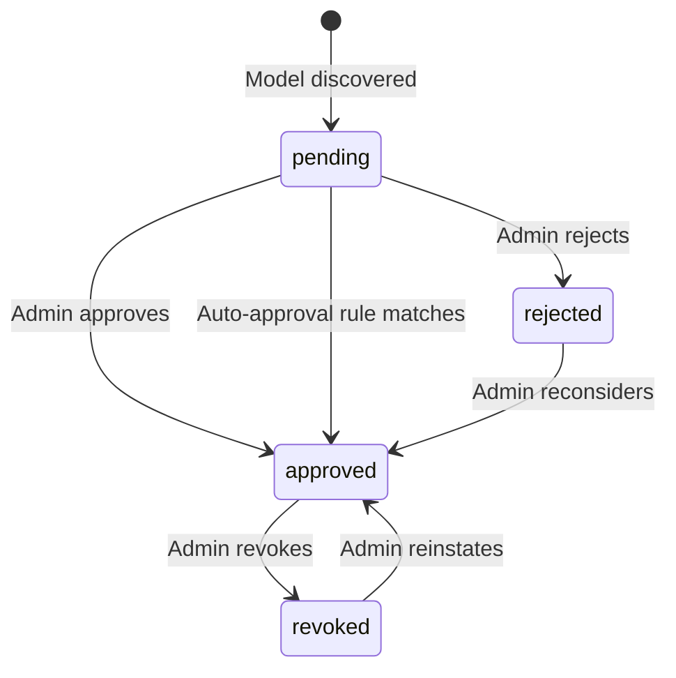

# PRD: Model Registry

## 1. Overview

**Purpose**: Model Registry provides a centralized catalog of AI models with tenant-level availability and approval workflows.

Model Registry is the authoritative source for model metadata, capabilities, provider cost data, and tenant access control. It tracks which models are available from which providers and manages approval workflows. LLM Gateway queries the registry to resolve model identifiers to provider endpoints and verify tenant access.

**Key Concepts**:

- **Canonical Model ID**: Deterministic identifier in format `{provider_slug}::{provider_model_id}` (e.g., `openai-prod::gpt-4o`, `ollama-us-west::mistral`). Parsing rule: split on **first** `::` occurrence.
- **Provider Slug**: Human-readable unique identifier for a specific provider configuration (instance). Different instances of the same provider type have different slugs (e.g., `azure-corp-global`, `azure-rnd-team`, `ollama-us-west`, `ollama-us-east`). Each slug represents a separate provider with its own credentials, base URL, and configuration.
- **Tenant Hierarchy**: Tree structure with root tenant at top; providers and approvals inherit down the tree (additive only)
- **Provider Plugins**: Each provider type has its own plugin; all requests route through Outbound API Gateway

**Provider Slug Examples**:

| Provider Type | Slug | Tenant | Description |
|---------------|------|--------|-------------|
| `azure` | `azure-prod` | root | Platform-wide Azure production |
| `azure` | `azure-prod` | tenant-A | Tenant A's own Azure (shadows root) |
| `openai` | `openai` | root | Platform OpenAI account |
| `ollama` | `ollama-local` | tenant-B | Tenant B's self-hosted Ollama |

**Provider Slug Resolution**: When resolving `{provider_slug}::{model_id}`, the system searches tenant → parent → ... → root (same as alias resolution). Child tenant's provider with same slug **shadows** parent's provider.

**Shadowing Example**:
- Root tenant configures `azure-prod` pointing to platform Azure subscription
- Tenant A configures own `azure-prod` pointing to their corporate Azure subscription
- When Tenant A requests `azure-prod::gpt-4o`, it resolves to Tenant A's Azure
- When Tenant B (no override) requests `azure-prod::gpt-4o`, it resolves to root's Azure

**Implication**: The same canonical ID can resolve to different provider instances depending on tenant context. Approvals are per (canonical_id, tenant) — approving `azure-prod::gpt-4o` in Tenant A approves their instance, not root's.

**Target Users**:

- **LLM Gateway** — Primary consumer for model resolution and availability checks
- **Tenant Administrators** — Approve/reject models, manage tenant-specific providers
- **Platform Administrators** — Configure root tenant providers

**Key Problems Solved**:

- **Model discovery**: Automatic polling of provider APIs to discover available models
- **Unified identification**: Canonical IDs abstract provider-specific naming
- **Access control**: Tenant-level approval workflow with hierarchical inheritance
- **Provider cost normalization**: AICredits-based provider cost data with tier support (sync/batch/cached) — used as input for billing calculations, not user-facing pricing

**Success Criteria**:

- Model resolution latency < 10ms P99
- 99.9% availability

### 1.1 Background

LLM Gateway requires a centralized source of truth for model availability, capabilities, and provider cost. Without Model Registry, each consumer would need to maintain its own model catalog, leading to inconsistency and duplicated approval workflows.

### 1.2 Goals

1. Single source of truth for AI model metadata across the platform — including both unmanaged models (cloud, frontier) and managed models (local, self-hosted)
2. Tenant-controlled model availability with inheritance from parent tenants
3. Streamlined approval process

### 1.3 Scope

#### In Scope

- Model catalog CRUD (models, providers)
- Tenant-level model availability configuration
- Approval workflows (request → approve/reject)
- Provider cost metadata (AICredits per tier) — raw cost from providers, not user-facing pricing
- Model capabilities metadata
- Cache management with TTL-based invalidation

#### Out of Scope

| Item | Reason / Owner |
|------|----------------|
| LLM inference execution | LLM Gateway |
| Provider credential management | OAGW |
| User-facing pricing (promos, discounts, tiered, regional) | License Manager |
| Usage metering & billing | License Manager |
| Tenant hierarchy management | Tenant Resolver |
| Actual rate limiting enforcement | Infrastructure / OAGW |
| Inference/routing health monitoring | OAGW (per-route, per-tenant-key availability) |
| Approval workflow engine | Generic Approval Service (Model Registry integrates with it) |
| Audit log storage & retention | Core platform |
| Model fine-tuning / training | Not in scope for v1 |
| Provider API contracts | Each provider plugin |
| Provider plugin architecture | DESIGN.md |
| Notifications | Separate notification system |

### 1.4 Assumptions

1. Tenant Resolver provides tenant hierarchy data reliably and is highly available
2. OAGW handles all provider authentication
3. OAGW enforces outbound URL policy (blocks internal networks, requires HTTPS)
4. Each provider plugin exposes an endpoint returning available models (implementation is plugin responsibility)
5. Distributed cache is available (default: Redis); cache backend is pluggable for vendor customization. If cache unavailable, fallback to direct DB queries
6. Platform authenticates requests and provides verified tenant context
7. Platform provides audit logging for all operations
8. Platform provides distributed tracing, structured logging, metrics, and health endpoints

### 1.5 Risks

| Risk | Impact | Mitigation |
|------|--------|------------|
| Cache invalidation delay | Stale model data served (up to TTL) | TTL-based expiry (own data 30 min, inherited 5 min) |
| Tenant hierarchy changes | Inherited approvals may become invalid | Invalidate tenant cache on re-parenting event |
| Provider removes model without notice | Requests fail until catalog synced | Periodic sync detection |

### 1.6 Glossary

| Term | Definition |
|------|------------|
| AICredits | Internal platform currency for model usage cost/pricing |
| Provider Cost | Raw cost data from providers in AICredits; NOT user-facing pricing |
| OAGW | Outbound API Gateway - handles provider authentication and circuit breaking |
| GTS | Global Type System - platform-wide type definitions and contracts |
| GTS Type (Provider) | Versioned provider type identifier (e.g., `gts.x.genai.model.provider.v1~msft.azure._.ai_studio.v1~`) |
| Root Tenant | Top-level tenant from which all other tenants inherit |
| Canonical ID | Unique model identifier in format `{provider_slug}::{provider_model_id}` |
| Provider Slug | Human-readable unique identifier for a provider instance (e.g., `azure-corp-global`) |
| Provider Plugin | Module responsible for communication with specific LLM provider |

## 2. Actors

### 2.1 Human Actors

#### Tenant Administrator

**ID**: `cpt-cf-model-registry-actor-tenant-admin`

**Role**: Approves or rejects models for tenant access. Manages tenant-specific providers. Can only restrict access compared to parent tenant, not expand.

#### Platform Administrator

**ID**: `cpt-cf-model-registry-actor-platform-admin`

**Role**: Manages root tenant configuration. Configures global providers. Sets baseline that all tenants inherit.

### 2.2 System Actors

#### LLM Gateway

**ID**: `cpt-cf-model-registry-actor-llm-gateway`

**Role**: Queries registry to resolve model identifiers (canonical ID) to provider details. Checks tenant availability. Retrieves model capabilities and provider cost.

## 3. Domain Model

### 3.1 Core Entities

#### Provider

Represents a configured AI provider instance for a tenant.

**Fields**:
- `id`: Internal unique identifier (UUID)
- `slug`: Human-readable unique identifier (e.g., `azure-corp-global`, `ollama-us-west`). Used in canonical model IDs. Immutable after creation.
- `tenant_id`: Owner tenant
- `name`: Display name
- `gts_type`: GTS type identifier for provider (e.g., `gts.x.genai.model.provider.v1~msft.azure._.ai_studio.v1~`)
- `base_url`: Provider API endpoint
- `status`: `active` | `disabled`
- `discovery`: Discovery config (enabled, interval)
- `timestamps`: created_at, updated_at

**GTS Type Benefits**:
- Versioned metadata schema per provider type (settings, UI configurations)
- Vendor and service encoded (distinguish `deepseek` as vendor vs `deepseek` hosted by nvidia)
- Native access control (grant/revoke access to specific provider types)
- Artifact lifecycle management (see all per-vendor artifacts in one place)

**Slug constraints**:
- 1-64 chars, lowercase alphanumeric + hyphen
- Unique within tenant (same slug can exist in different tenants)
- Immutable after creation — changing slug would invalidate all model references

**Inheritance & Shadowing**:
- Providers inherit down tenant hierarchy (additive)
- Child tenant sees parent's providers + own
- Child tenant CAN shadow inherited provider by creating provider with same slug
- Shadowing provider completely overrides parent's provider for that tenant and descendants
- Resolution order: tenant → parent → ... → root (first match wins)

**Excluding inherited providers**: Child tenant can exclude an inherited provider by shadowing it with `status: disabled`. This allows tenants to enforce their own policies (vendor partnership, liability cap, region restrictions, compliance isolation).

Example: Root has `azure-prod` (active). Tenant A shadows with `azure-prod` (disabled) → Azure is excluded for Tenant A and all its descendants.

**Health**: ProviderHealth stored at provider's owner tenant only. Child tenants inherit health status from parent.

#### Model

Represents an AI model in the catalog.

**Fields**:
- **Identification**: canonical_id (`{provider_slug}::{provider_model_id}`), provider_id, tenant_id, provider_model_id
- **Display**: name, description
- **Lifecycle**: lifecycle_status (GTS type for access control)
- **Infrastructure** (for local/managed LLMs):
  - `managed`: boolean — whether CyberFabric can load/unload this model
  - `architecture`: string — model architecture (e.g., `qwen`, `llama`, `mistral`, `gpt`)
  - `size_bytes`: integer — model size in bytes (for capacity planning)
  - `format`: string — model format (e.g., `gguf`, `mlx`, `safetensors`, `api-only`)
- **Capabilities (Tier 1)**: Boolean flags for text/image/audio/video/document input/output, tools, structured_output, streaming, embeddings, realtime_audio, batch_api
- **Limits (Tier 2)**: context_window, max_output_tokens, max_images_per_request, max_image_size_mb, max_audio_duration_sec
- **Provider Cost**: AICredits per tier (sync/batch/cached) for input/output tokens and media — raw provider cost data, not user-facing pricing
- **Status**: active, deprecated (soft-delete with deprecated_at timestamp)
- **Version**: Provider's model version, stored as-is

**Lifecycle Status** (GTS types for native access control):
| Status | GTS Type | Description |
|--------|----------|-------------|
| `production` | `gts.x.genai.model.lifecycle.v1~production~` | Stable, fully supported |
| `preview` | `gts.x.genai.model.lifecycle.v1~preview~` | Feature-complete but limited support |
| `experimental` | `gts.x.genai.model.lifecycle.v1~experimental~` | Early access, may change |
| `deprecated` | `gts.x.genai.model.lifecycle.v1~deprecated~` | Scheduled for removal |
| `sunset` | `gts.x.genai.model.lifecycle.v1~sunset~` | End of life, read-only |

**Infrastructure Fields Rationale**: For local/self-hosted LLMs, these fields enable:
- Capacity planning (size_bytes)
- Hardware compatibility checks (format, architecture)
- Dynamic model loading/unloading (managed)

#### ModelApproval

Tracks tenant approval status for a model. Integrates with generic **Approval Service** for workflow management.

**Note**: Model Registry does not implement approval workflow logic. It delegates to a generic Approval Service that can handle approvals for any resource type. Model Registry:
- Registers model as approvable resource with Approval Service
- Queries approval status from Approval Service
- Reacts to approval status changes via events

**Fields** (stored in Approval Service, referenced by Model Registry):
- `resource_type`: `model`
- `resource_id`: model_canonical_id
- `tenant_id`: tenant context
- `status`: pending/approved/rejected/revoked
- `decided_at`, `decided_by`: approval decision metadata
- `auto_approval_rule_id`: reference to rule that triggered auto-approval (null for manual)

**State Machine** (managed by Approval Service):

#### AutoApprovalRule (P2)

Defines rules for automatic model approval. Managed by **Approval Service** with model-specific criteria defined by Model Registry.

**Note**: Auto-approval rules are a feature of the generic Approval Service. Model Registry provides model-specific criteria schema; Approval Service handles rule evaluation and execution.

**Fields** (in Approval Service): id, resource_type (`model`), tenant_id (root = platform-wide), criteria, action (allow/block), priority, created_at, created_by.

**Model-specific criteria schema** (provided by Model Registry):
- `provider_gts_type`: GTS type pattern | "*" (required, "*" = any, supports wildcards for version matching)
- `provider_slug`: string | "*" (required, "*" = any)
- `capabilities`: string[] (optional, empty = any)

**Matching**: ALL criteria must match (AND). Model must have ALL listed capabilities (subset matching).

**Rule evaluation** (by Approval Service):
- Platform (root tenant) rules set the ceiling
- Tenant rules can only restrict further, not expand
- `block` from platform = blocked for all descendants
- Tenant cannot `allow` what platform blocked

**Authorization**: Read/list visible to tenant admins only.

#### ProviderHealth (P2)

Stores provider **discovery health** status — NOT routing/inference health.

**Scope limitation**: This is discovery-level health only (can we reach the provider's models endpoint?). It does NOT reflect:
- Inference endpoint availability (OAGW responsibility)
- Per-route or per-tenant-API-key availability (OAGW responsibility)
- SLA metrics for actual model calls (OAGW responsibility)

**Rationale**: Same provider can have different availability depending on route or per-tenant API key. Routing health is OAGW's responsibility. Model Registry only tracks whether discovery can reach the provider.

**Fields**: provider_id, tenant_id, status (healthy/degraded/unhealthy), metrics (latency p50/p99, consecutive failures/successes), last_check, last_success, last_error, last_error_message.

**Status derivation** (from discovery call results):
- `unhealthy`: 3+ consecutive discovery failures
- `degraded`: discovery response latency > 2000ms
- `healthy`: 2+ consecutive successes, latency OK

**Authorization**: `status` field visible to all authenticated users within tenant hierarchy. Error details (`last_error_message`, `last_error`) visible to tenant admins only.

#### Alias (P2)

Maps human-friendly names to canonical model IDs.

**Fields**: name (1-64 chars, alphanumeric + hyphen/underscore), tenant_id, canonical_id (must be canonical ID, not another alias), created_at, created_by.

**Resolution order**: Tenant alias → Parent tenant alias → ... → Root tenant alias → Canonical ID

**Shadowing**: Child tenant aliases can shadow parent aliases. Child tenant controls their namespace.

## 4. Functional Requirements

### P1 — Core (MVP)

#### Tenant Isolation

- [ ] `p1` - **ID**: `cpt-cf-model-registry-fr-tenant-isolation`

The system must enforce tenant isolation for all operations.

- All API operations MUST include tenant context
- Model/Approval queries MUST filter by tenant hierarchy (current tenant + ancestors)
- Write operations MUST validate tenant ownership
- Admin operations (approve/reject) MUST verify actor has admin role for target tenant

#### Authorization

- [ ] `p1` - **ID**: `cpt-cf-model-registry-fr-authorization`

The system must enforce role-based and GTS-based authorization.

**Role-based access** (operations):
| Operation | Required Role |
|-----------|---------------|
| List/Get models | Any authenticated user |
| Request model approval | Tenant member |
| Approve/Reject request | Tenant admin |
| Manage providers | Platform admin (root tenant) |

**GTS-based access** (model/provider access control):
| Access Type | GTS Claim Required | Example |
|-------------|-------------------|---------|
| Provider access | Provider GTS type | `gts.x.genai.model.provider.v1~msft.azure.*` grants access to all Azure models |
| Lifecycle access | Lifecycle GTS type | `gts.x.genai.model.lifecycle.v1~experimental~` grants access to experimental models |

**Benefits of GTS-based access control**:
- Cheap generic rules — no custom development needed
- Native platform integration — use existing GTS claim infrastructure
- Flexible — grant/revoke access by provider type or model category at token level

**Actors**: `cpt-cf-model-registry-actor-tenant-admin`, `cpt-cf-model-registry-actor-platform-admin`

#### Input Validation

- [ ] `p1` - **ID**: `cpt-cf-model-registry-fr-input-validation`

The system must validate all input data.

| Field | Validation |
|-------|------------|
| Canonical ID | Must match pattern `{provider_slug}::{model_id}`, provider with slug must exist. Parse on first `::`. |
| Provider slug | 1-64 chars, lowercase alphanumeric + hyphen. Unique within tenant. Immutable. |
| Provider name | 1-32 chars, lowercase alphanumeric + hyphen |
| Capabilities | Must conform to GTS capability schema |
| Pricing values | Non-negative decimal (AICredits) |

#### Cache Isolation

- [ ] `p1` - **ID**: `cpt-cf-model-registry-fr-cache-isolation`

The system must isolate cached data by tenant.

Cache keys MUST include tenant_id as prefix.

Format: `mr:{tenant_id}:{entity}:{id}`

**TTL strategy**:
- Own data (tenant created): TTL 30 min
- Inherited data (from parent): TTL 5 min

**Cache invalidation on tenant re-parenting**: On `tenant.reparented` event, invalidate ALL cache entries for that tenant.

**Cache unavailable**: Fallback to direct DB queries (latency SLOs may be violated). Cache backend is pluggable (default: Redis).

#### Get Tenant Model

- [ ] `p1` - **ID**: `cpt-cf-model-registry-fr-get-tenant-model`

The system must resolve a canonical model ID for a tenant, returning model info and provider details if approved.

Resolution:
1. Look up model in catalog by canonical ID
2. Check tenant approval status (direct or inherited)
3. Return model info + provider details

Response structure defined in GTS contract.

**Actors**: `cpt-cf-model-registry-actor-llm-gateway`

#### List Tenant Models

- [ ] `p1` - **ID**: `cpt-cf-model-registry-fr-list-tenant-models`

The system must return all models available for a tenant.

Includes:
- Models from tenant's own providers (if approved)
- Models inherited from parent tenant hierarchy (if approved at any level)

Follows OData pagination standard. Supports OData `$filter` for filtering by capability, provider, approval_status.

Capability filtering uses subset matching: model must have AT LEAST requested capabilities.

**Actors**: `cpt-cf-model-registry-actor-llm-gateway`

#### Model Discovery

- [ ] `p1` - **ID**: `cpt-cf-model-registry-fr-model-discovery`

The system must support discovery of available models from providers via Outbound API Gateway.

**Trigger mechanism**:
- **Default**: Manual action triggered by admin (via API or UI)
- **Optional**: Can be automated via external scheduled workflow (e.g., platform scheduler, Kubernetes CronJob)

Model Registry provides discovery API endpoint; scheduling is NOT built into Model Registry.

**Concurrency**: Fixed concurrency limit + staggered intervals when multiple discoveries run.

Per (tenant, provider) pair where discovery is enabled:
- Fetch models from provider's models endpoint (plugin responsibility)
- New models → create with `pending` status
- Existing models → update metadata (capabilities, limits, provider cost)
- Missing models → soft-delete (mark as `deprecated`)

**Dependencies**: OAGW (executes provider API calls), Provider API (returns models list)

#### Model Approval Integration

- [ ] `p1` - **ID**: `cpt-cf-model-registry-fr-model-approval`

The system must integrate with generic Approval Service for tenant-level model approval workflow.

**Model Registry responsibilities**:
- Register discovered models as approvable resources with Approval Service
- Query approval status from Approval Service when resolving models
- React to approval status change events

**Approval Service responsibilities** (out of Model Registry scope):
- Approval workflow engine (state machine, concurrency control)
- Approval UI and notifications
- Audit trail for approval decisions

Approval granularity (P1): Tenant-level — approval grants access to all users in tenant.

**Actors**: `cpt-cf-model-registry-actor-tenant-admin`

#### Provider Management

- [ ] `p1` - **ID**: `cpt-cf-model-registry-fr-provider-management`

The system must support tenant-scoped provider configuration.

Provider inheritance:
- Providers inherit down tenant hierarchy (additive only)
- Child tenant sees parent's providers + own providers
- Child CAN shadow inherited provider by creating provider with same slug (overrides for that tenant and descendants)
- Child CAN exclude inherited provider by shadowing with `status: disabled` (for compliance, vendor policy, region restrictions)

Provider config:
- ID, slug, name, gts_type, base URL, status (active/disabled)
- Discovery enabled/interval

Credentials handled by OAGW — not stored in Model Registry.

**Actors**: `cpt-cf-model-registry-actor-platform-admin`

#### Model Provider Cost

- [ ] `p1` - **ID**: `cpt-cf-model-registry-fr-model-pricing`

The system must store and provide model provider cost data in AICredits.

**Important**: This is raw provider cost data obtained from providers, NOT user-facing pricing. User-facing pricing (including promos, volume discounts, tiered pricing, regional pricing) is the responsibility of License Manager.

Cost structure:
- Unit: AICredits (internal platform currency)
- Tiers: sync, batch, cached (different rates per tier)
- Media: per image input, per audio minute, per image output

Model Registry returns **provider cost only**. Caller (LLM Gateway) fetches tenant pricing from License Manager and computes final user-facing price.

**Actors**: `cpt-cf-model-registry-actor-llm-gateway`

### P2 — Enhanced Features

#### Auto-Approval Rules

- [ ] `p2` - **ID**: `cpt-cf-model-registry-fr-auto-approval`

The system must integrate with Approval Service for automatic model approval based on configurable rules.

**Model Registry responsibilities**:
- Provide model-specific criteria schema to Approval Service
- Supply model metadata for rule evaluation when model is discovered

**Approval Service responsibilities**:
- Rule storage and management
- Rule evaluation and execution
- Hierarchy enforcement (platform ceiling, tenant restrictions)

Rule hierarchy (enforced by Approval Service):
- Platform (root tenant) rules set the ceiling (max allowed)
- Tenant rules can only restrict further
- Tenant cannot auto-approve what platform blocked

Model-specific rule matching criteria:
- Provider GTS type, provider slug, required capabilities (all must match)
- Action: `allow` or `block`
- Priority ordering for conflict resolution

Auto-approved models store reference to the triggering rule (`auto_approval_rule_id`).

**Actors**: `cpt-cf-model-registry-actor-tenant-admin`, `cpt-cf-model-registry-actor-platform-admin`

#### Provider Discovery Health Storage

- [ ] `p2` - **ID**: `cpt-cf-model-registry-fr-health-monitoring`

The system must store provider **discovery health** status derived from discovery calls.

**Scope**: Discovery health only — can we reach the provider's models endpoint? This is NOT routing/inference health (which is OAGW responsibility).

**Implementation**: Health status is a byproduct of model discovery — no separate health probing infrastructure. When discovery runs, the response (success/failure, latency) updates health status.

Health derivation:
- `healthy`: discovery responding normally, latency acceptable
- `degraded`: discovery responding but latency > threshold
- `unhealthy`: consecutive discovery failures exceed threshold

Health stored at provider owner tenant only. Child tenants inherit parent's health status.

**Out of scope** (OAGW responsibility):
- Inference endpoint health
- Per-route availability
- Per-tenant-API-key availability

**Dependencies**: OAGW (executes provider API calls), Provider API (returns response for health derivation)

#### Alias Management

- [ ] `p2` - **ID**: `cpt-cf-model-registry-fr-alias-management`

The system must support model aliases with hierarchical scoping.

Alias scope:
- Root tenant: global aliases visible to all tenants
- Child tenant: can override global aliases, add tenant-specific aliases

Resolution order: tenant → parent → ... → root → canonical ID

Constraint: Alias target MUST be a canonical ID, not another alias (prevents circular references).

**Actors**: `cpt-cf-model-registry-actor-tenant-admin`, `cpt-cf-model-registry-actor-platform-admin`

#### Degraded Mode

- [ ] `p2` - **ID**: `cpt-cf-model-registry-fr-degraded-mode`

The system must define tiered behavior when database is unavailable.

- Model capabilities and metadata: serve from stale cache (up to 30 min TTL)
- Approval verification: fail request with `service_unavailable` error

P1 behavior: DB unavailable = all requests fail (fail-closed).

#### Tenant Re-parenting

- [ ] `p2` - **ID**: `cpt-cf-model-registry-fr-tenant-reparenting`

The system must handle tenant hierarchy changes.

When tenant moves to different parent:
- Tenant Resolver owns re-parenting logic
- Model Registry invalidates all cache entries for affected tenant on `tenant.reparented` event
- Re-evaluation of approvals happens on next access

#### Bulk Operations

- [ ] `p2` - **ID**: `cpt-cf-model-registry-fr-bulk-operations`

The system must support batch approval operations: `approve_models(model_ids[])`, `reject_models(model_ids[])`.

#### Manual Discovery/Probe Trigger

- [ ] `p2` - **ID**: `cpt-cf-model-registry-fr-manual-trigger`

The system must allow platform admins to manually trigger discovery and health probes.

### P3 — Fine-Grained Access Control

#### User Group Approval

- [ ] `p3` - **ID**: `cpt-cf-model-registry-fr-user-group-approval`

The system must support model approval scoped to user groups within a tenant.

**Actors**: `cpt-cf-model-registry-actor-tenant-admin`

#### User-Level Override

- [ ] `p3` - **ID**: `cpt-cf-model-registry-fr-user-level-override`

The system must support individual user restrictions/allowances for model access.

**Actors**: `cpt-cf-model-registry-actor-tenant-admin`

## 5. Use Cases

### UC-001: Get Tenant Model

- [ ] `p1` - **ID**: `cpt-cf-model-registry-uc-get-tenant-model`

**Actor**: `cpt-cf-model-registry-actor-llm-gateway`

**Preconditions**: Tenant context available.

**Flow**:
1. LLM Gateway sends `get_tenant_model(ctx, canonical_id)`
2. Registry looks up model in catalog
3. Registry checks tenant approval (direct or inherited from parent)
4. Registry returns model info + provider details

**Postconditions**: Model info returned or error.

**Acceptance criteria**:
- Returns `model_not_found` (404) if model not in catalog
- Returns `model_not_approved` (403) if not approved for tenant (or any ancestor)
- Returns `model_deprecated` (410) if model was soft-deleted

### UC-002: List Tenant Models

- [ ] `p1` - **ID**: `cpt-cf-model-registry-uc-list-tenant-models`

**Actor**: `cpt-cf-model-registry-actor-llm-gateway`

**Preconditions**: Tenant context available.

**Flow**:
1. LLM Gateway sends `list_tenant_models(ctx)` with OData query params
2. Registry collects approved models for tenant (direct + inherited)
3. Registry applies OData filters
4. Registry returns paginated models list

**Postconditions**: Filtered models list returned.

**Acceptance criteria**:
- Follows OData pagination standard
- Supports `$filter` by capability flags, provider slug, provider GTS type, approval_status, lifecycle_status, managed, architecture, format
- Returns only approved models by default
- Excludes deprecated models

### UC-003: Model Discovery

- [ ] `p1` - **ID**: `cpt-cf-model-registry-uc-model-discovery`

**Actor**: `cpt-cf-model-registry-actor-platform-admin` (manual) or External Scheduler (automated)

**Preconditions**: Provider configured with `discovery.enabled = true`.

**Trigger**:
- Manual: Admin calls discovery API endpoint
- Automated: External scheduled workflow calls discovery API endpoint

**Flow**:
1. Discovery triggered for (tenant, provider) pair
2. Registry sends GET to provider's models endpoint via OAGW
3. Provider returns models list
4. Registry compares with current catalog:
   - New model → register with Approval Service as `pending`
   - Existing model → update metadata
   - Missing model → mark as `deprecated` (soft-delete)

**Postconditions**: Catalog updated.

**Acceptance criteria**:
- Discovery runs per (tenant, provider) pair
- Fixed concurrency limit with staggered intervals when multiple discoveries run
- Deprecated models are soft-deleted (hidden, not purged)
- Discovery API is idempotent (safe to call multiple times)

### UC-004: Model Approval

- [ ] `p1` - **ID**: `cpt-cf-model-registry-uc-model-approval`

**Actor**: `cpt-cf-model-registry-actor-tenant-admin`

**Preconditions**: Model in `pending` status for tenant in Approval Service.

**Flow**:
1. Tenant admin reviews pending models via Approval Service (or Model Registry API proxying to Approval Service)
2. Admin approves or rejects via Approval Service
3. Approval Service updates status and emits event
4. Model Registry receives event and updates local cache

**Postconditions**: Model approval status updated in Approval Service.

**Acceptance criteria**:
- State transitions managed by Approval Service
- Approval is tenant-scoped (P1)
- Approval recorded with actor and timestamp (by Approval Service)
- Model Registry correctly reflects approval status from Approval Service

### UC-005: Model Revocation

- [ ] `p1` - **ID**: `cpt-cf-model-registry-uc-model-revocation`

**Actor**: `cpt-cf-model-registry-actor-tenant-admin`

**Preconditions**: Model in `approved` status for tenant in Approval Service.

**Flow**:
1. Tenant admin selects approved model
2. Admin initiates revocation via Approval Service
3. Approval Service updates status to `revoked` and emits event
4. Model Registry receives event and updates local cache

**Postconditions**: Model access revoked.

**Acceptance criteria**:
- Revoked models return `model_not_approved` on access attempts
- In-flight requests complete, new requests rejected
- Revocation recorded with actor and timestamp (by Approval Service)
- Model can be reinstated: `revoked` → `approved`

### UC-006: Register Provider

- [ ] `p1` - **ID**: `cpt-cf-model-registry-uc-register-provider`

**Actor**: `cpt-cf-model-registry-actor-platform-admin`

**Preconditions**: Provider plugin exists for the specified type.

**Flow**:
1. Admin provides provider config (slug, name, gts_type, base_url, discovery config)
2. Registry validates slug is unique within tenant
3. Registry validates GTS type is supported (plugin exists)
4. Registry validates config against plugin requirements
5. Registry creates provider record with status `active`

**Postconditions**: Provider available for model sync. If slug matches parent's provider, this provider shadows the inherited one.

**Acceptance criteria**:
- Provider slug must be unique within tenant (can shadow parent's provider with same slug)
- Slug is immutable after creation
- GTS type must be valid and supported (plugin exists for this GTS type)

### UC-007: Disable Provider

- [ ] `p1` - **ID**: `cpt-cf-model-registry-uc-disable-provider`

**Actor**: `cpt-cf-model-registry-actor-platform-admin`

**Preconditions**: Provider is active.

**Flow**:
1. Admin requests provider disable
2. Registry marks provider status as `disabled`
3. Registry suspends discovery for this provider

**Postconditions**: Provider disabled, models not resolvable.

**Acceptance criteria**:
- Disabled provider's models return `provider_not_found`
- Discovery suspended

### UC-008: Re-enable Provider

- [ ] `p1` - **ID**: `cpt-cf-model-registry-uc-reenable-provider`

**Actor**: `cpt-cf-model-registry-actor-platform-admin`

**Preconditions**: Provider is disabled.

**Flow**:
1. Admin requests provider re-enable
2. Registry marks provider status as `active`
3. Discovery resumes on next scheduled run

**Postconditions**: Provider active, models resolvable.

### UC-009: Get Model Provider Cost

- [ ] `p1` - **ID**: `cpt-cf-model-registry-uc-get-pricing`

**Actor**: `cpt-cf-model-registry-actor-llm-gateway`

**Preconditions**: Model exists.

**Flow**:
1. Gateway sends `get_provider_cost(model_id)`
2. Registry retrieves provider cost for model
3. Registry returns provider cost by tier

**Postconditions**: Provider cost returned.

**Acceptance criteria**:
- Returns provider cost in AICredits (caller computes final user-facing price via License Manager)
- Tiers: sync, batch, cached
- Media cost included if applicable

### UC-010: Configure Auto-Approval Rule

- [ ] `p2` - **ID**: `cpt-cf-model-registry-uc-auto-approval-rule`

**Actor**: `cpt-cf-model-registry-actor-tenant-admin`, `cpt-cf-model-registry-actor-platform-admin`

**Preconditions**: Actor has admin role for target tenant.

**Flow**:
1. Admin defines rule criteria (provider GTS type, provider slug, capabilities)
2. Admin sets action (`allow` or `block`) and priority
3. Model Registry forwards rule to Approval Service with model-specific criteria schema
4. Approval Service validates rule does not expand beyond platform ceiling
5. Approval Service creates rule

**Postconditions**: Rule active for future model discoveries.

**Acceptance criteria**:
- Tenant rules cannot allow what platform blocked (enforced by Approval Service)
- Rules evaluated in priority order (by Approval Service)
- Auto-approved models reference the triggering rule

### UC-011: Get Provider Discovery Health

- [ ] `p2` - **ID**: `cpt-cf-model-registry-uc-provider-health`

**Actor**: `cpt-cf-model-registry-actor-llm-gateway`

**Preconditions**: Provider exists and discovery is enabled (health derived from discovery).

**Flow**:
1. Gateway queries provider discovery health status
2. Registry returns stored health status (healthy/degraded/unhealthy)
3. Gateway MAY use status as one input for routing decisions (not the only signal)

**Postconditions**: Stored discovery health status returned.

**Note**: This is discovery health only. For routing decisions, Gateway should also consult OAGW for inference-level health.

**Acceptance criteria**:
- Status field visible to all authenticated users within tenant hierarchy
- Error details visible only to tenant admins
- Child tenants inherit parent's provider health
- Health status reflects latest discovery results

### UC-012: Create Alias

- [ ] `p2` - **ID**: `cpt-cf-model-registry-uc-create-alias`

**Actor**: `cpt-cf-model-registry-actor-tenant-admin`, `cpt-cf-model-registry-actor-platform-admin`

**Preconditions**: Target canonical ID exists.

**Flow**:
1. Admin provides alias name and target canonical ID
2. Registry validates alias name format (1-64 chars, alphanumeric + hyphen/underscore)
3. Registry validates target is canonical ID (not another alias)
4. Registry creates alias scoped to tenant

**Postconditions**: Alias resolvable for tenant and descendants.

**Acceptance criteria**:
- Alias name must be unique within tenant
- Target must be canonical ID, not alias (prevents cycles)
- Child tenant aliases can shadow parent aliases

### UC-013: Resolve Alias

- [ ] `p2` - **ID**: `cpt-cf-model-registry-uc-resolve-alias`

**Actor**: `cpt-cf-model-registry-actor-llm-gateway`

**Preconditions**: Alias or canonical ID provided.

**Flow**:
1. Gateway sends model identifier (alias or canonical ID)
2. Registry checks tenant aliases → parent aliases → ... → root aliases
3. Registry returns resolved canonical ID

**Postconditions**: Canonical ID returned.

**Acceptance criteria**:
- Resolution order: tenant → parent → ... → root → canonical ID
- Non-existent alias falls through to canonical ID lookup

### UC-014: Handle Degraded Mode

- [ ] `p2` - **ID**: `cpt-cf-model-registry-uc-degraded-mode`

**Actor**: `cpt-cf-model-registry-actor-llm-gateway`

**Preconditions**: Database unavailable.

**Flow**:
1. Gateway requests model info
2. Registry detects DB unavailable
3. For metadata: serve from stale cache (up to TTL)
4. For approval check: return `service_unavailable` error

**Postconditions**: Partial response or error returned.

**Acceptance criteria**:
- Metadata served from cache (best-effort)
- Approval verification always fails when DB unavailable
- Error clearly indicates degraded state

### UC-015: Handle Tenant Re-parenting

- [ ] `p2` - **ID**: `cpt-cf-model-registry-uc-tenant-reparenting`

**Actor**: Internal (event handler)

**Preconditions**: Tenant Resolver emits `tenant.reparented` event.

**Flow**:
1. Registry receives `tenant.reparented` event
2. Registry invalidates ALL cache entries for affected tenant
3. Next access triggers fresh resolution with new hierarchy

**Postconditions**: Cache invalidated, approvals re-evaluated on access.

**Acceptance criteria**:
- All cache keys with tenant prefix invalidated
- No stale inherited data served after re-parenting

### UC-016: Bulk Approve Models

- [ ] `p2` - **ID**: `cpt-cf-model-registry-uc-bulk-approve`

**Actor**: `cpt-cf-model-registry-actor-tenant-admin`

**Preconditions**: Models in `pending` status for tenant in Approval Service.

**Flow**:
1. Admin provides list of model IDs to approve
2. Model Registry forwards bulk approval request to Approval Service
3. Approval Service approves all models in single transaction

**Postconditions**: All models approved or none (atomic).

**Acceptance criteria**:
- Atomic operation (all succeed or all fail) — handled by Approval Service
- Returns list of results per model
- Maximum batch size enforced (configurable)

### UC-017: Trigger Discovery

- [ ] `p1` - **ID**: `cpt-cf-model-registry-uc-manual-discovery`

**Actor**: `cpt-cf-model-registry-actor-platform-admin`, `cpt-cf-model-registry-actor-tenant-admin`

**Preconditions**: Provider configured with discovery enabled. Actor has admin access to provider's tenant.

**Flow**:
1. Admin (or external scheduler) calls discovery API for provider
2. Registry queues discovery job
3. Discovery executes and updates catalog

**Postconditions**: Provider catalog updated.

**Acceptance criteria**:
- Returns job status (queued/running/completed)
- Rate limited to prevent abuse
- Tenant admin can trigger discovery for own providers; Platform admin can trigger for any provider

### UC-018: Approve Model for User Group

- [ ] `p3` - **ID**: `cpt-cf-model-registry-uc-user-group-approval`

**Actor**: `cpt-cf-model-registry-actor-tenant-admin`

**Preconditions**: Model approved at tenant level, user groups defined.

**Flow**:
1. Admin selects approved model
2. Admin restricts access to specific user groups
3. Registry creates group-scoped approval

**Postconditions**: Model accessible only to specified groups.

**Acceptance criteria**:
- Group approval is restriction (not expansion) of tenant approval
- Users in multiple groups get union of permissions

### UC-019: Override User Access

- [ ] `p3` - **ID**: `cpt-cf-model-registry-uc-user-override`

**Actor**: `cpt-cf-model-registry-actor-tenant-admin`

**Preconditions**: Model has tenant or group approval.

**Flow**:
1. Admin selects user and model
2. Admin grants or revokes access for specific user
3. Registry creates user-level override

**Postconditions**: User access modified independent of group/tenant.

**Acceptance criteria**:
- User override takes precedence over group and tenant approvals
- Can both grant (if tenant allows) and revoke access

## 6. Auditable Operations

The following operations MUST be logged for audit compliance:

| Operation | Audit Fields |
|-----------|--------------|
| Model approved | model_id, tenant_id, actor_id, timestamp |
| Model rejected | model_id, tenant_id, actor_id, timestamp |
| Model revoked | model_id, tenant_id, actor_id, timestamp |
| Provider registered | provider_id, tenant_id, actor_id, timestamp |
| Provider disabled | provider_id, tenant_id, actor_id, timestamp |
| Provider enabled | provider_id, tenant_id, actor_id, timestamp |
| Alias created (P2) | alias_name, target, tenant_id, actor_id, timestamp |
| Alias updated (P2) | alias_name, old_target, new_target, tenant_id, actor_id, timestamp |
| Alias deleted (P2) | alias_name, tenant_id, actor_id, timestamp |
| Auto-approval rule created (P2) | rule_id, criteria, tenant_id, actor_id, timestamp |
| Auto-approval rule updated (P2) | rule_id, tenant_id, actor_id, timestamp |
| Auto-approval rule deleted (P2) | rule_id, tenant_id, actor_id, timestamp |

Read operations are not audited (high volume, low value).

## 7. Non-Functional Requirements

### Performance

- [ ] `p1` - **ID**: `cpt-cf-model-registry-nfr-performance`

| Operation | P50 | P99 |
|-----------|-----|-----|
| `get_tenant_model` | 2ms | 10ms |
| `list_tenant_models` | 10ms | 50ms |
| `approve_model` | - | 100ms |
| Discovery job (per provider) | - | 30s |

Caching: Distributed cache (default: Redis, pluggable) with TTL-based invalidation.
- Own data: 30 min TTL
- Inherited data: 5 min TTL

### Availability

- [ ] `p1` - **ID**: `cpt-cf-model-registry-nfr-availability`

Target: 99.9% availability.

P1: DB unavailable = requests fail (fail-closed).

P2: Tiered degraded mode (metadata from cache, approval check fails).

Cache unavailable: Fallback to direct DB queries (higher latency).

### Scale

- [ ] `p1` - **ID**: `cpt-cf-model-registry-nfr-scale`

| Dimension | Target |
|-----------|--------|
| Models per provider | 100 |
| Providers per tenant | 20 |
| Tenants | 10,000 |
| Total models (worst case) | ~2,000,000 |
| Read:Write ratio | 1000:1 |

### Rate Limiting

- [ ] `p1` - **ID**: `cpt-cf-model-registry-nfr-rate-limiting`

The system must specify rate limits for admin operations (enforcement by infrastructure).

| Operation | Limit |
|-----------|-------|
| Model approval requests | 100/min per tenant |
| Provider management | 10/min (platform-wide) |

All limits must be configurable.

## 8. Error Codes

| Code | HTTP Status | Description |
|------|-------------|-------------|
| `model_not_found` | 404 | Model identifier does not exist in catalog |
| `model_not_approved` | 403 | Model exists but not approved for tenant |
| `model_deprecated` | 410 | Model was removed by provider (soft-deleted) |
| `provider_not_found` | 404 | Provider identifier does not exist |
| `provider_disabled` | 404 | Provider exists but is disabled |
| `invalid_transition` | 409 | Invalid approval state transition (e.g., concurrent modification) |
| `validation_error` | 400 | Input validation failed |
| `unauthorized` | 403 | Actor lacks required role for operation |
| `service_unavailable` | 503 | Database unavailable |

Error responses follow RFC 9457 Problem Details standard.

## 9. Security Considerations

| Threat | Mitigation |
|--------|------------|
| Tenant data leakage | Tenant ID prefix in all cache keys; query filters enforce tenant scope |
| Unauthorized approval | Role-based authorization checks on all admin operations |
| Cache poisoning | TTL-based expiry; no user-controlled cache keys |
| Provider credential exposure | Credentials handled by OAGW, not stored in Model Registry |
| Privilege escalation via hierarchy | Child tenants can only restrict, not expand parent permissions |
| Stale approval served | Approval status always verified from DB (P1 fail-closed) |

## 10. Dependencies

| Module | Role |
|--------|------|
| Outbound API Gateway | Execute provider API calls (discovery) |
| Tenant Resolver | Resolve tenant hierarchy (parent, children) |
| Approval Service | Generic approval workflow engine for model approvals |
| GTS | API contract types |

## 11. Consumers

| Module | Usage |
|--------|-------|
| LLM Gateway | Model resolution, availability checks, provider cost |
| Chat Engine | Model selection for conversations |
| Tenant Admin UI | Approval management, provider configuration |

## 12. Public Library Interfaces

To be defined in DESIGN.md.

Key interfaces:
- `ModelRegistryClient` — SDK for LLM Gateway integration
- `AdminClient` — SDK for Tenant Admin UI

## 13. Acceptance Criteria

| Category | Criteria | Priority |
|----------|----------|----------|
| Functional | All P1 Use Cases pass acceptance tests | P1 |
| Performance | `get_tenant_model` < 10ms P99 | P1 |
| Performance | `list_tenant_models` < 50ms P99 | P1 |
| Availability | 99.9% uptime | P1 |
| Security | Tenant isolation enforced for all operations | P1 |
| Security | Authorization checks pass for all protected endpoints | P1 |
| Integration | LLM Gateway can resolve models and check availability | P1 |
| Integration | Tenant Admin UI can manage approvals | P1 |

## 14. Open Questions

| # | Question | Status | Decision |
|---|----------|--------|----------|
| 1 | Database-level locking vs application-level for approval concurrency | Deferred | ADR to be created |
| 2 | Specific QPS targets per endpoint | Deferred | DESIGN.md |
| 3 | Provider plugin retry policies | Deferred | DESIGN.md |

## 15. Migration & Rollback

**Initial deployment**: No migration required (greenfield).

**Schema changes**:
- Forward-compatible changes only
- Rollback via previous deployment + compatible schema

**Data migration**: To be defined per release in DESIGN.md.

**Cache invalidation on deployment**: Clear all cache keys on major version deployment.

## 16. Traceability

| Artifact | Link |
|----------|------|
| LLM Gateway PRD | `modules/llm_gateway/docs/PRD.md` |
| ADR: Stateless Gateway | `modules/llm_gateway/docs/ADR/0001-fdd-llmgw-adr-stateless.md` |
| ADR: Pass-through Content | `modules/llm_gateway/docs/ADR/0002-fdd-llmgw-adr-pass-through.md` |
| ADR: Circuit Breaking | `modules/llm_gateway/docs/ADR/0004-fdd-llmgw-adr-circuit-breaking.md` |
| OData Pagination Standard | `docs/modkit_unified_system/07_odata_pagination_select_filter.md` |
| Error Handling Standard | `docs/modkit_unified_system/05_errors_rfc9457.md` |
| GTS Contracts | `gts/` (to be defined) |
